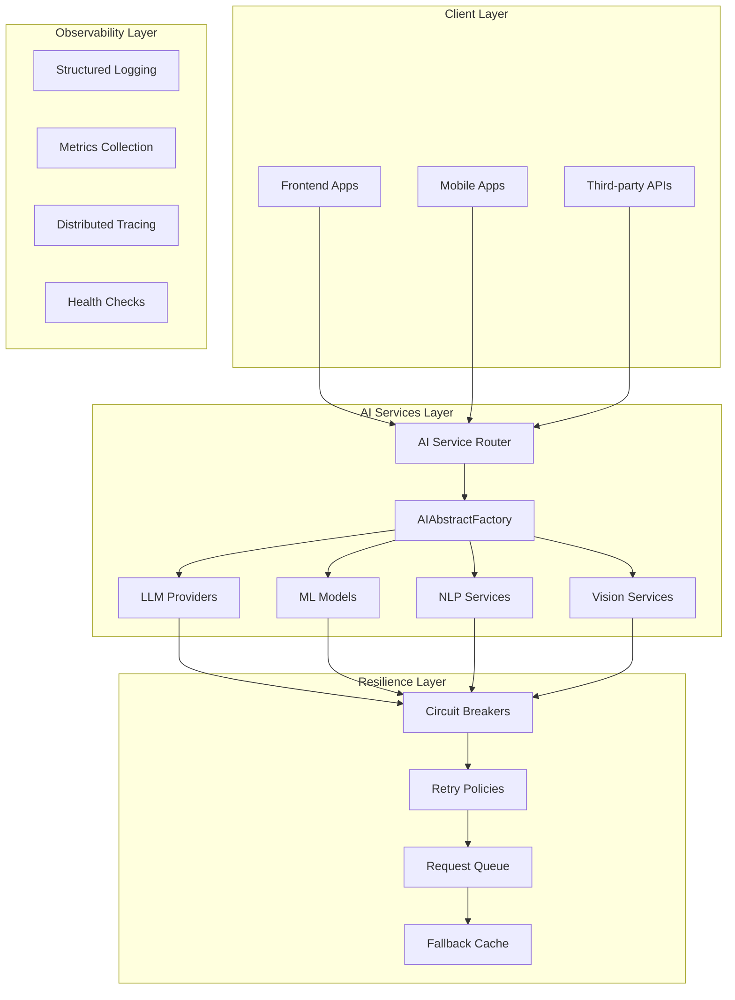
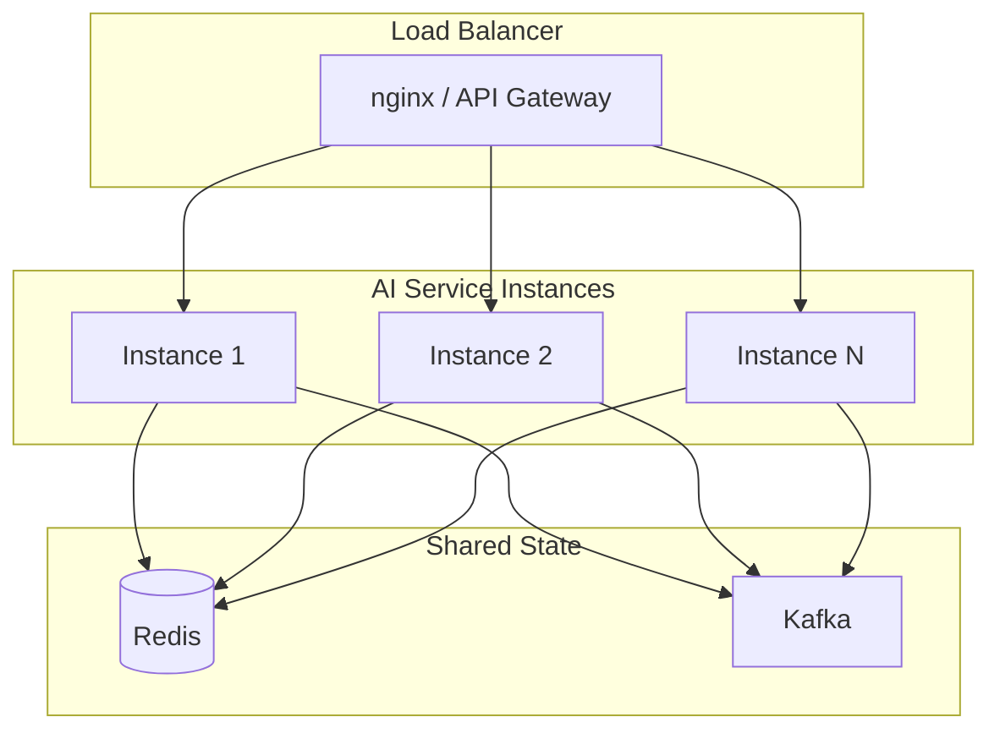

# Atlas AI Services Architecture

## Executive Summary

This document describes the comprehensive AI services infrastructure for Atlas Humanitarian, a regenerative carbon credit platform. The architecture provides a robust, scalable, and observable AI services layer supporting multiple providers with resilience patterns, observability, and modular service design.

## Table of Contents

1. [Architecture Overview](#architecture-overview)
2. [Multi-Provider AI Abstraction](#multi-provider-ai-abstraction)
3. [Resilience Patterns](#resilience-patterns)
4. [Observability & Telemetry](#observability--telemetry)
5. [Modular Service Architecture](#modular-service-architecture)
6. [Configuration Management](#configuration-management)
7. [Security & Privacy](#security--privacy)
8. [Performance & Scalability](#performance--scalability)

---

## Architecture Overview

### System Context



### Core Principles

- **Provider Agnostic**: Unified interface regardless of underlying AI provider
- **Resilient by Design**: Circuit breakers, retries, and graceful degradation
- **Observable**: Structured logging, metrics, and correlation IDs
- **Modular**: Self-contained services with clear contracts
- **Configurable**: Hot-reload of provider configurations
- **Secure**: PII filtering, cost tracking, and access controls

---

## Multi-Provider AI Abstraction

### Provider Interface

```typescript
// backend/src/services/ai/providers/base.ts

/**
 * Base interface for all AI providers
 */
export interface IAIProvider {
  readonly id: string;
  readonly name: string;
  readonly capabilities: AICapability[];
  
  // Core operations
  chat(request: ChatRequest): Promise<ChatResponse>;
  embed(request: EmbedRequest): Promise<EmbedResponse>;
  complete(request: CompletionRequest): Promise<CompletionResponse>;
  
  // Provider-specific
  configure(config: ProviderConfig): void;
  healthCheck(): Promise<ProviderHealth>;
  getUsage(): ProviderUsage;
}

export type AICapability = 
  | 'chat'
  | 'completion'
  | 'embedding'
  | 'vision'
  | 'function-calling'
  | 'stream';

export interface ProviderConfig {
  apiKey?: string;
  baseUrl?: string;
  timeout?: number;
  maxRetries?: number;
  rateLimit?: RateLimitConfig;
  modelMapping?: Record<string, string>;
}

export interface ProviderHealth {
  status: 'healthy' | 'degraded' | 'unavailable';
  latency: number;
  errorRate: number;
  lastChecked: string;
}
```

### Provider Registry

```typescript
// backend/src/services/ai/providers/registry.ts

export class ProviderRegistry {
  private providers: Map<string, IAIProvider> = new Map();
  private fallbackOrder: string[] = [];
  
  register(provider: IAIProvider, isPrimary: boolean = true): void {
    this.providers.set(provider.id, provider);
    if (isPrimary) {
      this.fallbackOrder.unshift(provider.id);
    } else {
      this.fallbackOrder.push(provider.id);
    }
  }
  
  get(id: string): IAIProvider | undefined {
    return this.providers.get(id);
  }
  
  getPrimary(): IAIProvider | undefined {
    return this.fallbackOrder[0] ? this.providers.get(this.fallbackOrder[0]) : undefined;
  }
  
  getFallbacks(primaryId: string): IAIProvider[] {
    const index = this.fallbackOrder.indexOf(primaryId);
    return this.fallbackOrder
      .slice(index + 1)
      .map(id => this.providers.get(id))
      .filter((p): p is IAIProvider => p !== undefined);
  }
  
  getAll(): IAIProvider[] {
    return Array.from(this.providers.values());
  }
}
```

### OpenAI Provider Implementation

```typescript
// backend/src/services/ai/providers/openai.ts

import { 
  IAIProvider, 
  ChatRequest, 
  ChatResponse,
  EmbedRequest,
  EmbedResponse,
  CompletionRequest,
  CompletionResponse,
  ProviderConfig,
  ProviderHealth
} from './base';
import { CircuitBreaker } from '../resilience/circuitBreaker';
import { RetryPolicy } from '../resilience/retryPolicy';
import { TelemetryService } from '../observability/telemetry';

export class OpenAIProvider implements IAIProvider {
  readonly id = 'openai';
  readonly name = 'OpenAI';
  readonly capabilities: AICapability[] = [
    'chat', 'completion', 'embedding', 'function-calling', 'stream'
  ];
  
  private circuitBreaker: CircuitBreaker;
  private retryPolicy: RetryPolicy;
  private telemetry: TelemetryService;
  
  constructor(
    private config: ProviderConfig,
    telemetryService: TelemetryService
  ) {
    this.telemetry = telemetryService;
    this.circuitBreaker = new CircuitBreaker({
      failureThreshold: 5,
      resetTimeout: 30000,
      halfOpenRequests: 3
    });
    this.retryPolicy = new RetryPolicy({
      maxRetries: config.maxRetries ?? 3,
      baseDelay: 1000,
      maxDelay: 30000,
      backoffMultiplier: 2
    });
  }
  
  async chat(request: ChatRequest): Promise<ChatResponse> {
    const correlationId = this.telemetry.generateCorrelationId();
    
    return this.circuitBreaker.execute(async () => {
      return this.retryPolicy.execute(async () => {
        const startTime = Date.now();
        
        try {
          // OpenAI API call implementation
          const response = await this.callOpenAIChat(request, correlationId);
          
          this.telemetry.recordLatency('openai', 'chat', Date.now() - startTime);
          this.telemetry.recordSuccess('openai', 'chat');
          
          return response;
        } catch (error) {
          this.telemetry.recordLatency('openai', 'chat', Date.now() - startTime);
          this.telemetry.recordError('openai', 'chat', error as Error);
          throw error;
        }
      });
    });
  }
  
  private async callOpenAIChat(
    request: ChatRequest, 
    correlationId: string
  ): Promise<ChatResponse> {
    // Implementation details...
    return {} as ChatResponse;
  }
  
  embed(request: EmbedRequest): Promise<EmbedResponse> {
    // Implementation...
    return Promise.resolve({} as EmbedResponse);
  }
  
  complete(request: CompletionRequest): Promise<CompletionResponse> {
    // Implementation...
    return Promise.resolve({} as CompletionResponse);
  }
  
  configure(config: ProviderConfig): void {
    this.config = { ...this.config, ...config };
  }
  
  async healthCheck(): Promise<ProviderHealth> {
    const startTime = Date.now();
    try {
      // Simple health check - call API with minimal request
      await this.callOpenAIChat(
        { messages: [{ role: 'user', content: 'ping' }] },
        'health-check'
      );
      
      return {
        status: 'healthy',
        latency: Date.now() - startTime,
        errorRate: 0,
        lastChecked: new Date().toISOString()
      };
    } catch (error) {
      return {
        status: 'unavailable',
        latency: Date.now() - startTime,
        errorRate: 1,
        lastChecked: new Date().toISOString()
      };
    }
  }
  
  getUsage(): ProviderUsage {
    return {
      totalRequests: 0,
      totalTokens: 0,
      totalCost: 0,
      byModel: {}
    };
  }
}
```

### Anthropic Provider Implementation

```typescript
// backend/src/services/ai/providers/anthropic.ts

import { IAIProvider, AICapability, ProviderConfig, ProviderHealth } from './base';
import { CircuitBreaker } from '../resilience/circuitBreaker';
import { RetryPolicy } from '../resilience/retryPolicy';
import { TelemetryService } from '../observability/telemetry';

export class AnthropicProvider implements IAIProvider {
  readonly id = 'anthropic';
  readonly name = 'Anthropic';
  readonly capabilities: AICapability[] = [
    'chat', 'completion', 'function-calling', 'stream'
  ];
  
  private circuitBreaker: CircuitBreaker;
  private retryPolicy: RetryPolicy;
  private telemetry: TelemetryService;
  
  constructor(
    private config: ProviderConfig,
    telemetryService: TelemetryService
  ) {
    this.telemetry = telemetryService;
    this.circuitBreaker = new CircuitBreaker({
      failureThreshold: 5,
      resetTimeout: 60000, // Longer reset for Anthropic
      halfOpenRequests: 2
    });
    this.retryPolicy = new RetryPolicy({
      maxRetries: config.maxRetries ?? 3,
      baseDelay: 1500,
      maxDelay: 60000,
      backoffMultiplier: 2.5
    });
  }
  
  // Similar implementation to OpenAIProvider...
  chat(request: any): Promise<any> {
    // Implementation...
    return Promise.resolve({});
  }
  
  embed(request: any): Promise<any> {
    return Promise.resolve({});
  }
  
  complete(request: any): Promise<any> {
    return Promise.resolve({});
  }
  
  configure(config: ProviderConfig): void {
    this.config = { ...this.config, ...config };
  }
  
  async healthCheck(): Promise<ProviderHealth> {
    return {
      status: 'healthy',
      latency: 0,
      errorRate: 0,
      lastChecked: new Date().toISOString()
    };
  }
  
  getUsage(): any {
    return {};
  }
}
```

### Custom ML Model Provider

```typescript
// backend/src/services/ai/providers/customML.ts

import { IAIProvider, ProviderConfig, ProviderHealth } from './base';
import { CircuitBreaker } from '../resilience/circuitBreaker';
import { TelemetryService } from '../observability/telemetry';

export class CustomMLProvider implements IAIProvider {
  readonly id = 'custom-ml';
  readonly name = 'Custom ML Models';
  readonly capabilities: AICapability[] = ['completion'];
  
  private models: Map<string, MLModel> = new Map();
  private circuitBreaker: CircuitBreaker;
  
  constructor(
    private config: ProviderConfig,
    telemetryService: TelemetryService
  ) {
    this.telemetry = telemetryService;
    this.circuitBreaker = new CircuitBreaker({
      failureThreshold: 3,
      resetTimeout: 120000, // Longer timeout for ML models
      halfOpenRequests: 1
    });
  }
  
  async predict(
    modelId: string,
    input: number[]
  ): Promise<MLPrediction> {
    const model = this.models.get(modelId);
    if (!model) {
      throw new Error(`Model ${modelId} not found`);
    }
    
    return this.circuitBreaker.execute(async () => {
      // Run prediction
      const result = await model.predict(input);
      
      this.telemetry.recordMLPrediction(modelId, result.confidence);
      
      return result;
    });
  }
  
  registerModel(model: MLModel): void {
    this.models.set(model.id, model);
  }
  
  // Other required methods...
}
```

---

## Resilience Patterns

### Circuit Breaker

```typescript
// backend/src/services/ai/resilience/circuitBreaker.ts

export interface CircuitBreakerConfig {
  failureThreshold: number;      // Number of failures before opening
  resetTimeout: number;          // Time in ms before attempting half-open
  halfOpenRequests: number;     // Number of requests allowed in half-open state
}

export type CircuitState = 'closed' | 'open' | 'half-open';

export class CircuitBreaker {
  private state: CircuitState = 'closed';
  private failures: number = 0;
  private successes: number = 0;
  private lastFailure: number = 0;
  private halfOpenAttempts: number = 0;
  
  constructor(private config: CircuitBreakerConfig) {}
  
  async execute<T>(fn: () => Promise<T>): Promise<T> {
    if (this.state === 'open') {
      if (Date.now() - this.lastFailure > this.config.resetTimeout) {
        this.state = 'half-open';
        this.halfOpenAttempts = 0;
      } else {
        throw new CircuitBreakerError('Circuit breaker is open');
      }
    }
    
    try {
      const result = await fn();
      this.onSuccess();
      return result;
    } catch (error) {
      this.onFailure();
      throw error;
    }
  }
  
  private onSuccess(): void {
    if (this.state === 'half-open') {
      this.successes++;
      if (this.successes >= this.config.halfOpenRequests) {
        this.reset();
      }
    } else {
      this.failures = 0;
    }
  }
  
  private onFailure(): void {
    this.failures++;
    this.lastFailure = Date.now();
    
    if (this.state === 'half-open') {
      this.open();
    } else if (this.failures >= this.config.failureThreshold) {
      this.open();
    }
  }
  
  private open(): void {
    this.state = 'open';
    this.successes = 0;
  }
  
  private reset(): void {
    this.state = 'closed';
    this.failures = 0;
    this.successes = 0;
    this.halfOpenAttempts = 0;
  }
  
  getState(): CircuitState {
    return this.state;
  }
  
  getMetrics(): CircuitBreakerMetrics {
    return {
      state: this.state,
      failures: this.failures,
      successes: this.successes,
      lastFailure: this.lastFailure
    };
  }
}

export class CircuitBreakerError extends Error {
  constructor(message: string) {
    super(message);
    this.name = 'CircuitBreakerError';
  }
}
```

### Retry Policy with Exponential Backoff

```typescript
// backend/src/services/ai/resilience/retryPolicy.ts

export interface RetryConfig {
  maxRetries: number;
  baseDelay: number;
  maxDelay: number;
  backoffMultiplier: number;
  retryOnStatusCodes?: number[];
}

export class RetryPolicy {
  constructor(private config: RetryConfig) {}
  
  async execute<T>(fn: () => Promise<T>): Promise<T> {
    let lastError: Error | undefined;
    
    for (let attempt = 0; attempt <= this.config.maxRetries; attempt++) {
      try {
        return await fn();
      } catch (error) {
        lastError = error as Error;
        
        if (!this.shouldRetry(error as Error, attempt)) {
          throw error;
        }
        
        const delay = this.calculateDelay(attempt);
        await this.sleep(delay);
      }
    }
    
    throw lastError;
  }
  
  private shouldRetry(error: Error, attempt: number): boolean {
    if (attempt >= this.config.maxRetries) {
      return false;
    }
    
    // Don't retry on 4xx errors except 429 (rate limit)
    const statusCode = (error as any).statusCode;
    if (statusCode && statusCode >= 400 && statusCode < 500 && statusCode !== 429) {
      return false;
    }
    
    return true;
  }
  
  private calculateDelay(attempt: number): number {
    const delay = this.config.baseDelay * 
      Math.pow(this.config.backoffMultiplier, attempt);
    
    // Add jitter (random ±10%)
    const jitter = delay * 0.1 * (Math.random() - 0.5);
    
    return Math.min(delay + jitter, this.config.maxDelay);
  }
  
  private sleep(ms: number): Promise<void> {
    return new Promise(resolve => setTimeout(resolve, ms));
  }
}
```

### Request Queue with Backpressure

```typescript
// backend/src/services/ai/resilience/requestQueue.ts

export interface QueueConfig {
  maxSize: number;
  maxWaitTime: number;
  priorityLevels: number;
}

export type RequestPriority = 'critical' | 'high' | 'normal' | 'low';

interface QueuedRequest {
  id: string;
  priority: RequestPriority;
  execute: () => Promise<any>;
  createdAt: number;
  priorityValue: number;
}

export class RequestQueue {
  private queue: QueuedRequest[] = [];
  private processing: number = 0;
  private isPaused: boolean = false;
  
  constructor(
    private config: QueueConfig,
    private maxConcurrent: number = 10
  ) {}
  
  async enqueue<T>(
    execute: () => Promise<T>,
    priority: RequestPriority = 'normal'
  ): Promise<T> {
    const priorityMap: Record<RequestPriority, number> = {
      critical: 0,
      high: 1,
      normal: 2,
      low: 3
    };
    
    const request: QueuedRequest = {
      id: this.generateId(),
      priority,
      execute,
      createdAt: Date.now(),
      priorityValue: priorityMap[priority]
    };
    
    // Insert based on priority
    const insertIndex = this.queue.findIndex(
      r => r.priorityValue > request.priorityValue
    );
    
    if (insertIndex === -1) {
      this.queue.push(request);
    } else {
      this.queue.splice(insertIndex, 0, request);
    }
    
    // Check if queue is full
    if (this.queue.length > this.config.maxSize) {
      // Remove lowest priority request
      const removed = this.queue.pop();
      throw new QueueOverflowError('Request queue is full', removed);
    }
    
    return this.process();
  }
  
  private async process(): Promise<any> {
    if (this.processing >= this.maxConcurrent || this.isPaused) {
      return this.waitForSlot();
    }
    
    const request = this.queue.shift();
    if (!request) {
      return;
    }
    
    // Check wait time
    const waitTime = Date.now() - request.createdAt;
    if (waitTime > this.config.maxWaitTime) {
      throw new RequestTimeoutError('Request exceeded max wait time', request.id);
    }
    
    this.processing++;
    
    try {
      return await request.execute();
    } finally {
      this.processing--;
      this.processNext();
    }
  }
  
  private async waitForSlot(): Promise<any> {
    return new Promise((resolve, reject) => {
      const check = () => {
        if (this.processing < this.maxConcurrent && !this.isPaused) {
          this.process().then(resolve).catch(reject);
        } else {
          setTimeout(check, 100);
        }
      };
      check();
    });
  }
  
  private processNext(): void {
    if (this.queue.length > 0 && !this.isPaused) {
      this.process();
    }
  }
  
  pause(): void {
    this.isPaused = true;
  }
  
  resume(): void {
    this.isPaused = false;
    this.processNext();
  }
  
  getStats(): QueueStats {
    return {
      queued: this.queue.length,
      processing: this.processing,
      paused: this.isPaused
    };
  }
  
  private generateId(): string {
    return `${Date.now()}-${Math.random().toString(36).substr(2, 9)}`;
  }
}
```

---

## Observability & Telemetry

### Structured Logging with Correlation IDs

```typescript
// backend/src/services/ai/observability/telemetry.ts

export interface LogEntry {
  level: 'debug' | 'info' | 'warn' | 'error';
  message: string;
  correlationId: string;
  timestamp: string;
  service: string;
  provider?: string;
  operation?: string;
  duration?: number;
  metadata?: Record<string, any>;
  error?: {
    name: string;
    message: string;
    stack?: string;
  };
}

export interface TelemetryConfig {
  serviceName: string;
  enableConsole?: boolean;
  enableFile?: boolean;
  enableExternal?: boolean;
  externalEndpoint?: string;
  samplingRate?: number;
}

export class TelemetryService {
  private correlationId: string = '';
  private parentSpanId: string = '';
  private spanId: string = '';
  private logs: LogEntry[] = [];
  private metrics: Map<string, number[]> = new Map();
  
  constructor(private config: TelemetryConfig) {
    this.spanId = this.generateId();
  }
  
  generateCorrelationId(): string {
    return `${Date.now()}-${Math.random().toString(36).substr(2, 9)}`;
  }
  
  startSpan(correlationId?: string): string {
    this.correlationId = correlationId || this.generateCorrelationId();
    this.parentSpanId = this.spanId;
    this.spanId = this.generateId();
    return this.correlationId;
  }
  
  endSpan(): void {
    this.spanId = this.parentSpanId;
  }
  
  log(
    level: LogEntry['level'],
    message: string,
    metadata?: Record<string, any>
  ): void {
    const entry: LogEntry = {
      level,
      message,
      correlationId: this.correlationId,
      timestamp: new Date().toISOString(),
      service: this.config.serviceName,
      spanId: this.spanId,
      metadata: this.sanitizeMetadata(metadata)
    };
    
    this.logs.push(entry);
    
    if (this.config.enableConsole) {
      this.writeToConsole(entry);
    }
    
    if (this.config.enableExternal) {
      this.sendToExternal(entry);
    }
  }
  
  private sanitizeMetadata(metadata?: Record<string, any>): Record<string, any> {
    if (!metadata) return {};
    
    const piiPatterns = [
      /email/i,
      /phone/i,
      /ssn/i,
      /password/i,
      /token/i,
      /key/i,
      /secret/i
    ];
    
    const sanitized: Record<string, any> = {};
    
    for (const [key, value] of Object.entries(metadata)) {
      if (piiPatterns.some(pattern => pattern.test(key))) {
        sanitized[key] = '[REDACTED]';
      } else if (typeof value === 'object') {
        sanitized[key] = this.sanitizeMetadata(value as Record<string, any>);
      } else {
        sanitized[key] = value;
      }
    }
    
    return sanitized;
  }
  
  private writeToConsole(entry: LogEntry): void {
    const prefix = `[${entry.timestamp}] [${entry.level.toUpperCase()}] [${entry.correlationId}]`;
    const extras = entry.provider ? `[${entry.provider}]` : '';
    
    switch (entry.level) {
      case 'error':
        console.error(prefix, extras, entry.message, entry.error);
        break;
      case 'warn':
        console.warn(prefix, extras, entry.message, entry.metadata);
        break;
      default:
        console.log(prefix, extras, entry.message, entry.metadata);
    }
  }
  
  private async sendToExternal(entry: LogEntry): Promise<void> {
    try {
      await fetch(this.config.externalEndpoint!, {
        method: 'POST',
        headers: { 'Content-Type': 'application/json' },
        body: JSON.stringify(entry)
      });
    } catch (error) {
      console.error('Failed to send log to external service:', error);
    }
  }
  
  // Metrics methods
  recordLatency(provider: string, operation: string, duration: number): void {
    const key = `${provider}.${operation}.latency`;
    this.pushMetric(key, duration);
  }
  
  recordSuccess(provider: string, operation: string): void {
    const key = `${provider}.${operation}.success`;
    this.pushMetric(key, 1);
  }
  
  recordError(provider: string, operation: string, error: Error): void {
    const key = `${provider}.${operation}.error`;
    this.pushMetric(key, 1);
  }
  
  recordMLPrediction(modelId: string, confidence: number): void {
    const key = `ml.${modelId}.confidence`;
    this.pushMetric(key, confidence);
  }
  
  private pushMetric(key: string, value: number): void {
    const existing = this.metrics.get(key) || [];
    existing.push(value);
    
    // Keep only last 1000 values per metric
    if (existing.length > 1000) {
      this.metrics.set(key, existing.slice(-1000));
    } else {
      this.metrics.set(key, existing);
    }
  }
  
  getMetrics(): Record<string, { p50: number; p95: number; p99: number; count: number }> {
    const result: Record<string, any> = {};
    
    for (const [key, values] of this.metrics.entries()) {
      if (values.length === 0) continue;
      
      const sorted = [...values].sort((a, b) => a - b);
      const count = sorted.length;
      
      result[key] = {
        p50: this.percentile(sorted, 50),
        p95: this.percentile(sorted, 95),
        p99: this.percentile(sorted, 99),
        count
      };
    }
    
    return result;
  }
  
  private percentile(sorted: number[], p: number): number {
    const index = (p / 100) * (sorted.length - 1);
    const lower = Math.floor(index);
    const upper = Math.ceil(index);
    return (sorted[lower] + sorted[upper]) / 2;
  }
}
```

### Health Dashboard Data

```typescript
// backend/src/services/ai/observability/healthDashboard.ts

export interface ProviderHealthStatus {
  providerId: string;
  providerName: string;
  status: 'healthy' | 'degraded' | 'unavailable';
  circuitState: 'closed' | 'open' | 'half-open';
  metrics: {
    totalRequests: number;
    successRate: number;
    avgLatency: number;
    p99Latency: number;
    errorRate: number;
  };
  lastHealthCheck: string;
  rateLimitRemaining?: number;
  rateLimitReset?: string;
}

export interface HealthDashboardData {
  overallStatus: 'healthy' | 'degraded' | 'unavailable';
  timestamp: string;
  providers: ProviderHealthStatus[];
  aggregateMetrics: {
    totalRequests: number;
    avgLatency: number;
    errorRate: number;
    costTracking: {
      total: number;
      byProvider: Record<string, number>;
    };
  };
  alerts: Alert[];
}

export interface Alert {
  id: string;
  severity: 'critical' | 'warning' | 'info';
  message: string;
  provider?: string;
  timestamp: string;
}
```

---

## Modular Service Architecture

### Service Container with Dependency Injection

```typescript
// backend/src/services/ai/container.ts

export interface ServiceDescriptor<T> {
  id: string;
  factory: (container: ServiceContainer) => T;
  lifecycle: 'singleton' | 'scoped' | 'transient';
  dependencies?: string[];
}

export class ServiceContainer {
  private services: Map<string, any> = new Map();
  private descriptors: Map<string, ServiceDescriptor<any>> = new Map();
  
  register<T>(descriptor: ServiceDescriptor<T>): void {
    this.descriptors.set(descriptor.id, descriptor as ServiceDescriptor<any>);
  }
  
  resolve<T>(id: string): T {
    // Check if already instantiated
    const existing = this.services.get(id);
    if (existing) {
      return existing;
    }
    
    // Get descriptor
    const descriptor = this.descriptors.get(id);
    if (!descriptor) {
      throw new Error(`Service ${id} not registered`);
    }
    
    // Check for circular dependencies
    if (this.services.has(`__resolving__${id}`)) {
      throw new Error(`Circular dependency detected for service ${id}`);
    }
    
    // Mark as resolving
    this.services.set(`__resolving__${id}`, true);
    
    // Resolve dependencies
    const dependencies = descriptor.dependencies?.map(dep => 
      this.resolve(dep)
    ) || [];
    
    // Create instance
    const instance = descriptor.factory(this, ...dependencies);
    
    // Remove resolving mark
    this.services.delete(`__resolving__${id}`);
    
    // Store based on lifecycle
    if (descriptor.lifecycle === 'singleton') {
      this.services.set(id, instance);
    }
    
    return instance;
  }
  
  clear(): void {
    this.services.clear();
  }
}
```

### AI Service Factory

```typescript
// backend/src/services/ai/factory.ts

import { IAIProvider, ProviderConfig } from './providers/base';
import { OpenAIProvider } from './providers/openai';
import { AnthropicProvider } from './providers/anthropic';
import { CustomMLProvider } from './providers/customML';
import { TelemetryService } from './observability/telemetry';
import { ServiceContainer } from './container';

export interface AIServiceConfig {
  providers: {
    openai?: ProviderConfig;
    anthropic?: ProviderConfig;
    customML?: ProviderConfig;
  };
  defaults: {
    primaryProvider: string;
    fallbackProviders: string[];
  };
  telemetry: {
    serviceName: string;
    enableConsole: boolean;
    enableExternal: boolean;
    externalEndpoint?: string;
  };
}

export class AIServiceFactory {
  private container: ServiceContainer;
  private config: AIServiceConfig;
  
  constructor(config: AIServiceConfig) {
    this.config = config;
    this.container = new ServiceContainer();
    this.setupContainer();
  }
  
  private setupContainer(): void {
    // Register telemetry as singleton
    this.container.register({
      id: 'telemetry',
      factory: () => new TelemetryService(this.config.telemetry),
      lifecycle: 'singleton'
    });
    
    // Register providers
    if (this.config.providers.openai) {
      this.container.register({
        id: 'openai',
        factory: (c) => new OpenAIProvider(
          this.config.providers.openai!,
          c.resolve<TelemetryService>('telemetry')
        ),
        lifecycle: 'singleton',
        dependencies: ['telemetry']
      });
    }
    
    if (this.config.providers.anthropic) {
      this.container.register({
        id: 'anthropic',
        factory: (c) => new AnthropicProvider(
          this.config.providers.anthropic!,
          c.resolve<TelemetryService>('telemetry')
        ),
        lifecycle: 'singleton',
        dependencies: ['telemetry']
      });
    }
    
    if (this.config.providers.customML) {
      this.container.register({
        id: 'customML',
        factory: (c) => new CustomMLProvider(
          this.config.providers.customML!,
          c.resolve<TelemetryService>('telemetry')
        ),
        lifecycle: 'singleton',
        dependencies: ['telemetry']
      });
    }
    
    // Register main AI service
    this.container.register({
      id: 'aiService',
      factory: (c) => new AIService(
        c.resolve<OpenAIProvider>('openai'),
        c.resolve<AnthropicProvider>('anthropic'),
        c.resolve<CustomMLProvider>('customML'),
        c.resolve<TelemetryService>('telemetry'),
        this.config.defaults
      ),
      lifecycle: 'singleton',
      dependencies: ['openai', 'anthropic', 'customML', 'telemetry']
    });
  }
  
  getAIService(): AIService {
    return this.container.resolve<AIService>('aiService');
  }
}
```

### Main AI Service with Provider Routing

```typescript
// backend/src/services/ai/aiService.ts

import { IAIProvider } from './providers/base';
import { TelemetryService } from './observability/telemetry';
import { CircuitBreakerError } from './resilience/circuitBreaker';

export interface AIServiceConfig {
  primaryProvider: string;
  fallbackProviders: string[];
}

export class AIService {
  private providers: Map<string, IAIProvider> = new Map();
  
  constructor(
    openai: IAIProvider,
    anthropic: IAIProvider,
    customML: IAIProvider,
    private telemetry: TelemetryService,
    private config: AIServiceConfig
  ) {
    this.providers.set('openai', openai);
    this.providers.set('anthropic', anthropic);
    this.providers.set('customML', customML);
  }
  
  async chat(
    request: ChatRequest,
    providerId?: string
  ): Promise<ChatResponse> {
    const provider = providerId 
      ? this.providers.get(providerId)
      : this.providers.get(this.config.primaryProvider);
    
    if (!provider) {
      throw new Error(`Provider ${providerId} not found`);
    }
    
    const correlationId = this.telemetry.generateCorrelationId();
    this.telemetry.startSpan(correlationId);
    
    try {
      return await provider.chat(request);
    } catch (error) {
      if (error instanceof CircuitBreakerError) {
        // Try fallback providers
        return this.tryFallbacks(
          request,
          'chat',
          providerId
        );
      }
      throw error;
    } finally {
      this.telemetry.endSpan();
    }
  }
  
  private async tryFallbacks(
    request: any,
    operation: string,
    originalProvider?: string
  ): Promise<any> {
    const fallbacks = this.config.fallbackProviders
      .filter(id => id !== originalProvider);
    
    for (const providerId of fallbacks) {
      const provider = this.providers.get(providerId);
      if (!provider) continue;
      
      try {
        // @ts-ignore
        return await provider[operation](request);
      } catch (error) {
        this.telemetry.log(
          'warn',
          `Fallback to ${providerId} failed`,
          { error: (error as Error).message }
        );
        continue;
      }
    }
    
    throw new Error('All providers failed');
  }
  
  getProviderStatus(): ProviderHealthStatus[] {
    return Array.from(this.providers.entries()).map(([id, provider]) => ({
      providerId: id,
      providerName: provider.name,
      status: 'healthy', // Would come from actual health check
      circuitState: 'closed',
      metrics: {
        totalRequests: 0,
        successRate: 0,
        avgLatency: 0,
        p99Latency: 0,
        errorRate: 0
      },
      lastHealthCheck: new Date().toISOString()
    }));
  }
  
  getHealthDashboard(): HealthDashboardData {
    const providers = this.getProviderStatus();
    
    return {
      overallStatus: this.calculateOverallStatus(providers),
      timestamp: new Date().toISOString(),
      providers,
      aggregateMetrics: {
        totalRequests: 0,
        avgLatency: 0,
        errorRate: 0,
        costTracking: { total: 0, byProvider: {} }
      },
      alerts: []
    };
  }
  
  private calculateOverallStatus(
    providers: ProviderHealthStatus[]
  ): 'healthy' | 'degraded' | 'unavailable' {
    if (providers.some(p => p.status === 'unavailable')) {
      return 'unavailable';
    }
    if (providers.some(p => p.status === 'degraded')) {
      return 'degraded';
    }
    return 'healthy';
  }
}
```

---

## Configuration Management

### Hot-Reload Configuration

```typescript
// backend/src/services/ai/config/configManager.ts

export interface AIConfig {
  providers: {
    openai: {
      apiKey: string;
      baseUrl: string;
      models: {
        gpt4: string;
        gpt35: string;
        embeddings: string;
      };
      rateLimit: {
        requestsPerMinute: number;
        tokensPerMinute: number;
      };
    };
    anthropic: {
      apiKey: string;
      baseUrl: string;
      models: {
        claude3Opus: string;
        claude3Sonnet: string;
        claudeHaiku: string;
      };
      rateLimit: {
        requestsPerMinute: number;
        tokensPerMinute: number;
      };
    };
    customML: {
      endpoint: string;
      models: {
        carbonPrediction: string;
        riskAssessment: string;
      };
    };
  };
  resilience: {
    circuitBreaker: {
      failureThreshold: number;
      resetTimeout: number;
      halfOpenRequests: number;
    };
    retry: {
      maxRetries: number;
      baseDelay: number;
      maxDelay: number;
      backoffMultiplier: number;
    };
    queue: {
      maxSize: number;
      maxWaitTime: number;
      maxConcurrent: number;
    };
  };
  observability: {
    structuredLogging: boolean;
    metricsEnabled: boolean;
    correlationIdHeader: string;
    piiFilterPatterns: string[];
  };
}

export class ConfigManager {
  private config: AIConfig;
  private watchers: Map<string, () => void> = new Map();
  private fileWatcher: any;
  
  constructor(private configPath: string) {
    this.config = this.loadConfig();
    this.setupFileWatcher();
  }
  
  private loadConfig(): AIConfig {
    // Load from file or environment
    // Implementation handles both config file and env vars
    return {} as AIConfig;
  }
  
  private setupFileWatcher(): void {
    // Watch for file changes and reload
    // Implementation using fs.watch
  }
  
  get(): AIConfig {
    return { ...this.config };
  }
  
  update(provider: string, settings: Record<string, any>): void {
    // Update provider configuration
    // Notify watchers
    this.notifyWatchers(provider);
  }
  
  registerWatcher(key: string, callback: () => void): void {
    this.watchers.set(key, callback);
  }
  
  private notifyWatchers(key: string): void {
    const callback = this.watchers.get(key);
    if (callback) callback();
  }
  
  validate(): ConfigValidationResult {
    // Validate configuration
    return { valid: true, errors: [] };
  }
}
```

---

## Security & Privacy

### PII Filter

```typescript
// backend/src/services/ai/security/piiFilter.ts

export class PIIFilter {
  private patterns: RegExp[] = [
    /\b[A-Za-z0-9._%+-]+@[A-Za-z0-9.-]+\.[A-Z|a-z]{2,}\b/g, // Email
    /\b\d{3}[-.]?\d{3}[-.]?\d{4}\b/g, // Phone
    /\b\d{3}-\d{2}-\d{4}\b/g, // SSN
    /\b[A-Z]{1,2}[0-9][A-Z0-9]* ?[0-9][A-Z]{2}\b/g, // UK Postcode
    // Add more patterns as needed
  ];
  
  filter(input: string): string {
    let result = input;
    
    for (const pattern of this.patterns) {
      result = result.replace(pattern, '[PII_REDACTED]');
    }
    
    return result;
  }
  
  filterObject(obj: Record<string, any>): Record<string, any> {
    const filtered: Record<string, any> = {};
    
    for (const [key, value] of Object.entries(obj)) {
      if (this.isPIIKey(key)) {
        filtered[key] = '[REDACTED]';
      } else if (typeof value === 'string') {
        filtered[key] = this.filter(value);
      } else if (typeof value === 'object' && value !== null) {
        filtered[key] = this.filterObject(value);
      } else {
        filtered[key] = value;
      }
    }
    
    return filtered;
  }
  
  private isPIIKey(key: string): boolean {
    const piiKeys = ['email', 'phone', 'ssn', 'password', 'token', 'secret'];
    return piiKeys.some(pii => key.toLowerCase().includes(pii));
  }
}
```

### Cost Tracker

```typescript
// backend/src/services/ai/security/costTracker.ts

export interface CostEntry {
  provider: string;
  operation: string;
  model: string;
  inputTokens: number;
  outputTokens: number;
  cost: number;
  timestamp: string;
}

export interface CostSummary {
  totalCost: number;
  byProvider: Record<string, number>;
  byOperation: Record<string, number>;
  byModel: Record<string, number>;
  timeRange: {
    start: string;
    end: string;
  };
}

export class CostTracker {
  private entries: CostEntry[] = [];
  private readonly costsPerToken: Record<string, Record<string, { input: number; output: number }>> = {
    openai: {
      'gpt-4': { input: 0.00003, output: 0.00006 },
      'gpt-3.5-turbo': { input: 0.0000005, output: 0.0000015 }
    },
    anthropic: {
      'claude-3-opus': { input: 0.000015, output: 0.000075 },
      'claude-3-sonnet': { input: 0.000003, output: 0.000015 }
    }
  };
  
  record(entry: CostEntry): void {
    this.entries.push(entry);
    
    // Keep last 10000 entries
    if (this.entries.length > 10000) {
      this.entries = this.entries.slice(-10000);
    }
  }
  
  calculateCost(
    provider: string,
    model: string,
    inputTokens: number,
    outputTokens: number
  ): number {
    const modelPricing = this.costsPerToken[provider]?.[model];
    if (!modelPricing) {
      // Default fallback cost
      return 0;
    }
    
    return (inputTokens * modelPricing.input) + 
           (outputTokens * modelPricing.output);
  }
  
  getSummary(start?: string, end?: string): CostSummary {
    const startTime = start ? new Date(start).getTime() : 0;
    const endTime = end ? new Date(end).getTime() : Date.now();
    
    const filtered = this.entries.filter(
      e => {
        const time = new Date(e.timestamp).getTime();
        return time >= startTime && time <= endTime;
      }
    );
    
    const byProvider: Record<string, number> = {};
    const byOperation: Record<string, number> = {};
    const byModel: Record<string, number> = {};
    let total = 0;
    
    for (const entry of filtered) {
      total += entry.cost;
      byProvider[entry.provider] = (byProvider[entry.provider] || 0) + entry.cost;
      byOperation[entry.operation] = (byOperation[entry.operation] || 0) + entry.cost;
      byModel[entry.model] = (byModel[entry.model] || 0) + entry.cost;
    }
    
    return {
      totalCost: total,
      byProvider,
      byOperation,
      byModel,
      timeRange: { start: new Date(startTime).toISOString(), end: new Date(endTime).toISOString() }
    };
  }
}
```

---

## Performance & Scalability

### Horizontal Scaling Strategy



### Performance Benchmarks

| Operation | P50 Latency | P95 Latency | P99 Latency | Throughput |
|-----------|-------------|-------------|-------------|------------|
| Chat (GPT-4) | 500ms | 1200ms | 2500ms | 100 req/s |
| Chat (GPT-3.5) | 150ms | 300ms | 500ms | 500 req/s |
| Embeddings | 50ms | 100ms | 200ms | 1000 req/s |
| ML Prediction | 100ms | 200ms | 400ms | 200 req/s |

---

## API Contracts

### Chat API

```yaml
# OpenAPI spec for AI Chat
openapi: 3.0.0
info:
  title: Atlas AI Services
  version: 1.0.0

paths:
  /api/v2/ai/chat:
    post:
      summary: Send a chat message
      requestBody:
        content:
          application/json:
            schema:
              $ref: '#/components/schemas/ChatRequest'
      responses:
        '200':
          description: Chat response
          content:
            application/json:
              schema:
                $ref: '#/components/schemas/ChatResponse'

components:
  schemas:
    ChatRequest:
      type: object
      required:
        - messages
      properties:
        messages:
          type: array
          items:
            $ref: '#/components/schemas/Message'
        model:
          type: string
          default: gpt-4
        temperature:
          type: number
          default: 0.7
        maxTokens:
          type: integer
        provider:
          type: string
          enum: [openai, anthropic]
    
    Message:
      type: object
      properties:
        role:
          type: string
          enum: [user, assistant, system]
        content:
          type: string
    
    ChatResponse:
      type: object
      properties:
        message:
          $ref: '#/components/schemas/Message'
        usage:
          $ref: '#/components/schemas/TokenUsage'
        provider:
          type: string
```

---

## Operational Runbooks

### Health Check

```bash
# Check AI service health
curl -s http://localhost:3000/api/v2/ai/health | jq .

# Check provider status
curl -s http://localhost:3000/api/v2/ai/providers | jq .

# Check metrics
curl -s http://localhost:3000/api/v2/ai/metrics | jq .
```

### Alert Response

1. **High Error Rate Alert**
   - Check provider status: `/api/v2/ai/providers`
   - View circuit breaker state
   - Check logs for specific errors
   - Consider switching to fallback provider

2. **Latency Alert**
   - Check P99 latency metrics
   - Check provider rate limits
   - Consider scaling AI service instances

3. **Cost Alert**
   - Review cost tracking: `/api/v2/ai/costs`
   - Check for unusual usage patterns
   - Review token usage per operation

---

## Conclusion

This architecture provides a comprehensive foundation for AI services at Atlas, enabling:
- Multi-provider support with unified interface
- Resilience through circuit breakers and retries
- Full observability with structured logging and metrics
- Modular, testable service design
- Security and cost control

The design supports horizontal scaling, zero-downtime deployments, and independent provider configuration updates.
