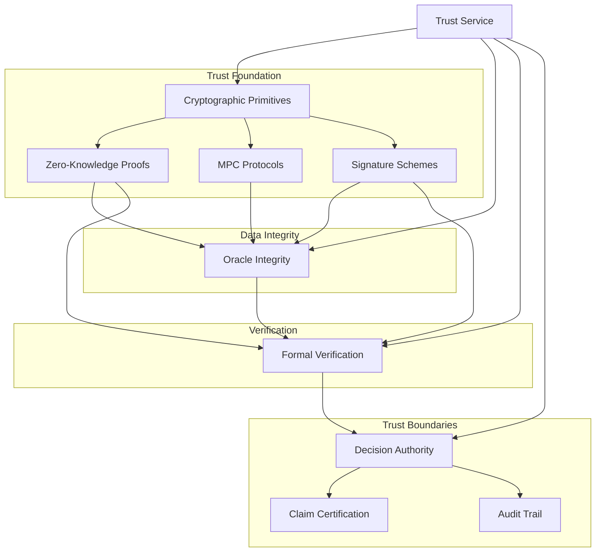

# Atlas Sanctum Cryptographic Trust Framework

## Technical Specification Document

**Version:** 1.0.0  
**Date:** 2024-02-07  
**Classification:** Foundation - Cryptographic Trust  
**Status:** Draft

---

## Executive Summary

This document defines the technical specification for the Atlas Sanctum Cryptographic Trust Framework, the foundational trust infrastructure that enables Atlas to make verifiable, cryptographically-backed claims about impact, security, and compliance. This framework implements the mandate of the Chief Cryptographic & Trust Engineer role, establishing the immutable foundation upon which all trust mechanisms are constructed, validated, and maintained.

The framework comprises seven core components:

1. **Cryptographic Primitives & Types** - Foundation type system and cryptographic building blocks
2. **Zero-Knowledge Proof System** - Privacy-preserving verification mechanisms
3. **Multi-Party Computation Protocols** - Distributed key management and threshold operations
4. **Digital Signature Schemes** - Advanced signature capabilities including aggregation and post-quantum
5. **Oracle Integrity Architecture** - Trusted data feed validation and aggregation
6. **Formal Verification System** - Mathematical correctness guarantees
7. **Trust Boundary & Decision Authority** - Claim certification and boundary enforcement

---

## 1. Introduction

### 1.1 Purpose and Scope

The Atlas Sanctum Cryptographic Trust Framework establishes the technical foundation for all trust-related operations within the Atlas ecosystem. Every protocol, every transaction, every verification flow traces back to decisions made within this framework. The responsibility is absolute: what this framework certifies becomes truth across the entire system, and what this framework rejects must never reach production.

This specification covers:

- Cryptographic primitive selection and implementation
- Zero-knowledge proof system architecture
- Multi-party computation protocols
- Advanced digital signature schemes
- Oracle integrity mechanisms
- Formal verification requirements
- Trust boundary enforcement

### 1.2 Design Principles

The framework adheres to the following design principles:

1. **Mathematical Rigor**: All trust mechanisms are grounded in mathematically provable properties
2. **Defense in Depth**: Multiple cryptographic layers provide redundancy against single points of failure
3. **Privacy by Default**: Zero-knowledge techniques minimize information disclosure
4. **Distributed Trust**: No single entity controls critical cryptographic operations
5. **Future-Proofing**: Post-quantum algorithms ensure long-term security
6. **Transparent Accountability**: All trust decisions are auditable and verifiable

### 1.3 Trust Level Hierarchy

The framework implements a six-level trust hierarchy:

| Level | Name | Description | Use Case |
|-------|------|-------------|----------|
| 0 | `untrusted` | No verification performed | Initial state, requires elevation |
| 1 | `low` | Basic validation only | Preliminary checks |
| 2 | `medium` | Third-party attestation present | Audited claims |
| 3 | `high` | Cryptographic proof provided | Verified assertions |
| 4 | `verified` | Proof + formal verification | Certified properties |
| 5 | `certified` | Maximum assurance level | Critical system claims |

---

## 2. Cryptographic Primitives & Types

### 2.1 Core Type System

The framework defines a comprehensive type system for cryptographic operations:

```typescript
// Key Types
type PrivateKey = string & { readonly __brand: unique symbol };
type PublicKey = string & { readonly __brand: unique symbol };
type KeyId = string & { readonly __brand: unique symbol };

// Key Purpose
type KeyPurpose = 'signing' | 'encryption' | 'key_agreement' | 'commitment';

// Supported Key Types
type KeyType =
  | 'secp256k1'      // Bitcoin/Ethereum signatures
  | 'ed25519'        // High-performance signatures
  | 'bls12-381'      // BLS aggregation
  | 'mlkem768'       // Post-quantum KEM
  | 'mldsa44'        // Post-quantum signatures
  | 'threshold'      // Threshold key shares
  | 'ecdsa'          // ECDSA
  | 'schnorr';      // Schnorr signatures
```

### 2.2 Signature Types

```typescript
interface CryptoSignature {
  readonly algorithm: KeyType;
  readonly r: string;                    // DER encoding or compact
  readonly s?: string;
  readonly recovery?: number;            // For recoverable signatures
  readonly publicKey: PublicKey;
  readonly timestamp: Timestamp;
  readonly domain?: string;             // Context for domain separation
}

interface BLSSignature {
  readonly signature: string;            // G1 point compressed
  readonly point: string;               // G2 point for verification
  readonly domain: string;
}

interface ThresholdSignaturePartial {
  readonly signerIndex: number;
  readonly partialSignature: string;
  readonly publicKeyShare: PublicKey;
}
```

### 2.3 Commitment Schemes

```typescript
type CommitmentScheme = 
  | 'Pedersen'         // Homomorphic commitment
  | 'KZG'              // Polynomial commitment
  | 'Merkle'           // Merkle tree commitment
  | 'Kate'            // Kate polynomial commitment;

interface Commitment {
  readonly scheme: CommitmentScheme;
  readonly commitment: string;          // Serialized commitment
  readonly opening?: CommitmentOpening;  // Opening information
}

interface MerkleProof {
  readonly root: string;
  readonly leaf: string;
  readonly path: readonly string[];
  readonly depth: number;
  readonly indices: readonly number[];
}
```

### 2.4 Hash Algorithms

```typescript
type HashAlgorithm =
  | 'SHA-256'           // SHA-2 256-bit
  | 'SHA3-256'          // SHA-3 256-bit
  | 'BLAKE3'           // BLAKE3 256-bit
  | 'POSEIDON'         // Stark-friendly hash
  | 'MIMC'             // Efficient zk hash
  | 'GRIND'            // ASIC-resistant hash;
```

---

## 3. Zero-Knowledge Proof System

### 3.1 Proof System Architecture

The ZK proof system supports multiple proof systems with different trade-offs:

```typescript
type ZKProofSystem =
  | 'Groth16'          // Short proofs, trusted setup required
  | 'PLONK'            // Universal trusted setup
  | 'Halo2'            // Recursive proofs, no setup
  | 'Nova';           // Incrementally computable
```

#### Comparison Matrix

| System | Proof Size | Verification Time | Trusted Setup | Recursive |
|--------|-----------|-------------------|---------------|-----------|
| Groth16 | ~192 bytes | ~10ms | Yes | No |
| PLONK | ~400 bytes | ~50ms | Universal | No |
| Halo2 | ~1KB | ~100ms | No | Yes |
| Nova | ~2KB | ~50ms | No | Yes |

### 3.2 Circuit Definitions

```typescript
interface ZKCircuit {
  readonly circuitId: string;
  readonly name: string;
  readonly description: string;
  readonly numPublicInputs: number;
  readonly numPrivateInputs: number;
  readonly numConstraints: number;
  readonly gates: readonly ZKGate[];
  readonly witnessGenerator?: string;
}

interface ZKConstraint {
  readonly type: 'linear' | 'quadratic' | 'lookup';
  readonly selectorA: number;
  readonly selectorB: number;
  readonly selectorC: number;
  readonly valueA?: string;
  readonly valueB?: string;
}

// Pre-defined Circuit Templates
class ImpactCircuit implements ZKCircuit {
  readonly circuitId = 'impact-circuit-v1';
  readonly name = 'Impact Verification Circuit';
  readonly numPublicInputs = 5;  // claim_id, timestamp, location, metric_type, value
  readonly numPrivateInputs = 3; // sensor_data, calculation_proof, attestations
  readonly numConstraints = 1000;
}

class RangeProofCircuit implements ZKCircuit {
  readonly circuitId = 'range-proof-v1';
  readonly name = 'Range Proof Circuit';
  readonly numPublicInputs = 2;  // commitment, value_bound
  readonly numPrivateInputs = 2; // value, randomness
  readonly numConstraints = 50;
}
```

### 3.3 Proof Generation

```typescript
interface ZKProof {
  readonly proofId: string;
  readonly proofSystem: ZKProofSystem;
  readonly circuitId: string;
  readonly proof: string;              // Serialized proof
  readonly publicInputs: readonly string[];
  readonly proofSize: number;
  readonly generationTimeMs: number;
  readonly metadata: ZKProofMetadata;
}

interface ZKProofRequest {
  readonly circuitId: string;
  readonly publicInputs: readonly ZKPublicInput[];
  readonly privateInputs: readonly ZKPrivateInput[];
  readonly proofSystem?: ZKProofSystem;
  readonly securityLevel?: number;      // Bits of security
}
```

### 3.4 Trusted Setup Management

```typescript
type TrustedSetupType = 
  | 'PerpetualPowersOfTau'  // Perpetual ceremony
  | 'Universal'             // Universal setup
  | 'Transparent';         // No trusted setup

interface ZKSnarkSetup {
  readonly setupId: string;
  readonly proofSystem: ZKProofSystem;
  readonly circuitId: string;
  readonly type: TrustedSetupType;
  readonly ceremonyId?: string;        // For PerpetualPowersOfTau
  readonly verificationKey: string;
  readonly provingKey: string;
  readonly contribution: string;
  readonly verified: boolean;
}
```

---

## 4. Multi-Party Computation Protocols

### 4.1 Supported MPC Protocols

```typescript
type MPCProtocol =
  | 'ShamirSecretSharing'    // SSS
  | 'BGW'                    // Ben-Or-Goldwasser-Wigderson
  | 'SPDZ'                   // Speedz
  | 'FROST'                  // Flexible Round-Optimized Schnorr
  | 'GG18'                   // Gennaro-Goldfeder
  | 'CKLS';                  // Canetti-Lindell-Katz-Nissim
```

### 4.2 Session Management

```typescript
interface MPCSession {
  readonly sessionId: string;
  readonly protocol: MPCProtocol;
  readonly threshold: number;          // Minimum parties required
  readonly totalParties: number;       // Total parties in session
  readonly status: 'initializing' | 'keygen' | 'active' | 'completed' | 'aborted';
  readonly createdAt: Timestamp;
  readonly expiresAt?: Timestamp;
  readonly parties: readonly MPCParty[];
}

interface MPCParty {
  readonly partyId: string;
  readonly publicKey: PublicKey;
  readonly status: 'connected' | 'disconnected' | 'malicious';
  readonly joinedAt: Timestamp;
  readonly lastActiveAt: Timestamp;
}
```

### 4.3 Threshold Key Generation

```typescript
interface ThresholdKeyGeneration {
  readonly keyId: KeyId;
  readonly protocol: MPCProtocol;
  readonly threshold: number;              // t-of-n
  readonly totalParties: number;
  readonly shares: readonly ThresholdKeyShare[];
  readonly combinedPublicKey: PublicKey;
  readonly verificationKey: string;
  readonly status: 'generating' | 'verifying' | 'completed' | 'failed';
}

interface ThresholdKeyShare {
  readonly shareIndex: number;
  readonly shareValue: string;             // Encrypted share
  readonly publicKeyShare: PublicKey;
  readonly verificationData: string;
}
```

### 4.4 FROST Integration

```typescript
interface FROSTKeyGen {
  readonly round: number;
  readonly totalRounds: number;
  readonly commitments: readonly string[];
  readonly secretShares: readonly string[];
  readonly groupPublicKey: PublicKey;
}

interface FROSTSigning {
  readonly signers: readonly number[];
  readonly nonceCommitments: readonly string[];
  readonly partialSignatures: readonly string[];
  readonly threshold: number;
  readonly message: string;
}
```

---

## 5. Digital Signature Schemes

### 5.1 BLS Signature Service

```typescript
class BLSService {
  readonly curve: 'BLS12-381' | 'BLS12-377' | 'BW6-761';
  readonly scheme: 'basic' | 'messageAugmentation' | 'proofOfPossession';

  async sign(message: string, privateKey: PrivateKey): Promise<BLSSignature>;
  async verify(message: string, signature: BLSSignature, publicKey: PublicKey): Promise<boolean>;
  async aggregateSignatures(signatures: readonly BLSSignature[]): Promise<BLSSignature>;
  async aggregatePublicKeys(publicKeys: readonly PublicKey[]): Promise<PublicKey>;
  async verifyProofOfPossession(publicKey: PublicKey, pop: BLSSignature): Promise<boolean>;
}
```

#### BLS Aggregation Strategies

1. **Basic Aggregation**: Simple point addition
2. **Proof of Possession**: Anti-Sybil aggregation with POP
3. **Threshold Aggregation**: T-of-N signature combination

### 5.2 Threshold Signature Service

```typescript
class ThresholdSignatureService {
  readonly protocol: 'FROST' | 'GG18';
  readonly threshold: number;
  readonly totalSigners: number;

  async generateKey(threshold: number, totalSigners: number): Promise<ThresholdKeyGeneration>;
  async createPartialSignature(share: ThresholdKeyShare, message: string): Promise<ThresholdSignaturePartial>;
  async combineSignatures(partials: readonly ThresholdSignaturePartial[]): Promise<CryptoSignature>;
  async reshare(oldShares: readonly ThresholdKeyShare[], newTotal: number): Promise<readonly ThresholdKeyShare[]>;
}
```

### 5.3 Post-Quantum Signature Service

```typescript
type PQCAlgorithm =
  | 'CRYSTALS-Dilithium'   // ML-DSA
  | 'SPHINCS+'            // Stateless hash-based
  | 'FALCON'              // FFT-based
  | 'Rainbow';           // Multivariate

class PostQuantumSignatureService {
  readonly algorithm: PQCAlgorithm;
  readonly securityLevel: number;  // 1, 3, or 5

  async generateKeyPair(): Promise<{ publicKey: PQPublicKey; privateKey: PQPrivateKey }>;
  async sign(message: string, privateKey: PQPrivateKey): Promise<PQSignature>;
  async verify(message: string, signature: PQSignature, publicKey: PQPublicKey): Promise<boolean>;
  async hybridSign(message: string, classicKey: PrivateKey, pqKey: PQPrivateKey): Promise<CryptoSignature>;
  async hybridVerify(message: string, signature: CryptoSignature, classicKey: PublicKey, pqKey: PQPublicKey): Promise<boolean>;
}
```

---

## 6. Oracle Integrity Architecture

### 6.1 Oracle Data Model

```typescript
interface OracleDataPoint {
  readonly pointId: string;
  readonly oracleId: string;
  readonly value: string;
  readonly timestamp: Timestamp;
  readonly source: string;
  readonly metadata: Record<string, unknown>;
  readonly signature: CryptoSignature;
  readonly blockNumber: number;
  readonly transactionHash: string;
}

interface OracleAttestation {
  readonly attestationId: string;
  readonly dataPointIds: readonly string[];
  readonly aggregatedValue: string;
  readonly confidence: Probability;
  readonly methodology: 'weighted_mean' | 'median' | 'trimmed_mean' | 'winsorized_mean';
  readonly outlierDetection: 'none' | 'zscore' | 'iqr' | 'mad';
}
```

### 6.2 Aggregation Strategies

```typescript
type AggregationStrategy = 
  | 'weighted_mean'      // Value-weighted average
  | 'median'             // Median of values
  | 'trimmed_mean'       // Mean after removing outliers
  | 'winsorized_mean'    // Winsorized mean
  | 'geometric_mean'     // Geometric mean
  | 'harmonic_mean'      // Harmonic mean;

interface AggregatedOracleData {
  readonly value: string;
  readonly confidence: Probability;
  readonly minValue: string;
  readonly maxValue: string;
  readonly standardDeviation: string;
  readonly participatingOracles: number;
  readonly consensusRatio: number;      // 0-1, agreement level
}
```

### 6.3 Byzantine Fault Tolerance

```typescript
interface OracleByzantineConfig {
  readonly minOracles: number;           // Minimum oracles required
  readonly maxByzantine: number;        // Maximum tolerated faulty oracles
  readonly consensusThreshold: number;   // Agreement threshold
  readonly disputeResolution: 'voting' | 'random' | 'authoritative';
}

const MIN_ORACLES = 3;  // 3f+1 formula
const MAX_BYZANTINE = Math.floor((MIN_ORACLES - 1) / 3);
```

### 6.4 Dispute Resolution

```typescript
interface OracleDispute {
  readonly disputeId: string;
  readonly dataPointId: string;
  readonly disputedValue: string;
  readonly challengerId: string;
  readonly evidence: readonly OracleDataPoint[];
  readonly status: 'open' | 'voting' | 'resolved' | 'escalated';
  readonly resolution?: string;
}

class OracleDisputeResolver {
  async openDispute(dataPointId: string, challengerId: string, evidence: readonly OracleDataPoint[]): Promise<OracleDispute>;
  async resolveByVoting(dispute: OracleDispute, votes: readonly { oracleId: string; value: string }[]): Promise<string>;
  async escalateToAuthoritative(dispute: OracleDispute, authoritativeSource: string): Promise<string>;
}
```

---

## 7. Formal Verification System

### 7.1 Verification Scope

```typescript
type VerificationMode =
  | 'model_checking'       // State space exploration
  | 'theorem_proving'     // Interactive proof
  | 'symbolic_execution'  // Path analysis
  | 'type_theory'         // Type-based verification
  | 'hoare_logic';       // Pre/post-condition verification
```

### 7.2 Protocol Verification

```typescript
interface ProtocolVerification {
  readonly protocolId: string;
  readonly verificationMode: VerificationMode;
  readonly properties: readonly ProtocolProperty[];
  readonly status: 'pending' | 'verified' | 'counterexample' | 'unknown';
  readonly proof?: string;
  readonly counterexample?: string;
}

interface ProtocolProperty {
  readonly propertyId: string;
  readonly name: string;
  readonly description: string;
  readonly type: 'safety' | 'liveness' | 'fairness' | 'security';
  readonly formula: string;              // TLA+ or similar
  readonly verified: boolean;
}
```

### 7.3 Invariant Monitoring

```typescript
interface InvariantAssertion {
  readonly invariantId: string;
  readonly name: string;
  readonly description: string;
  readonly expression: string;
  readonly checkInterval: number;         // Milliseconds
  readonly violationThreshold: number;
  readonly enabled: boolean;
}

interface InvariantViolation {
  readonly violationId: string;
  readonly invariantId: string;
  readonly timestamp: Timestamp;
  readonly state: Record<string, unknown>;
  readonly message: string;
  readonly severity: 'warning' | 'error' | 'critical';
}
```

### 7.4 Smart Contract Verification

```typescript
interface ContractSpecification {
  readonly contractId: string;
  readonly source: string;
  readonly language: 'solidity' | 'rust' | 'move';
  readonly properties: readonly ContractProperty[];
  readonly verificationMode: VerificationMode;
}

interface ContractProperty {
  readonly propertyId: string;
  readonly name: string;
  readonly specification: string;       // Formal spec
  readonly verified: boolean;
  readonly counterexample?: string;
}
```

---

## 8. Trust Boundary & Decision Authority

### 8.1 Claim Certification

```typescript
type ClaimCategory =
  | 'impact_claim'        // Environmental/social impact
  | 'security_claim'      // Security properties
  | 'performance_claim'   // Performance/SLAs
  | 'compliance_claim'    // Regulatory compliance
  | 'identity_claim'      // Identity verification
  | 'ownership_claim';    // Asset ownership

interface TrustAssertion {
  readonly assertionId: string;
  readonly claim: string;
  readonly claimType: ClaimType;
  readonly trustLevel: TrustLevel;
  readonly evidence: readonly TrustEvidence[];
  readonly verifier: string;
  readonly validFrom: Timestamp;
  readonly validUntil?: Timestamp;
  readonly scope: readonly ClaimType[];
  readonly revocation?: RevocationRecord;
}

interface TrustEvidence {
  readonly type: 'signature' | 'proof' | 'attestation' | 'oracle' | 'consensus';
  readonly data: string;
  readonly timestamp: Timestamp;
  readonly source: string;
}
```

### 8.2 Claim Boundaries

```typescript
interface ClaimBoundary {
  readonly boundaryId: string;
  readonly claim: string;
  readonly category: ClaimCategory;
  readonly maxTrustLevel: TrustLevel;
  readonly requiredEvidence: readonly TrustEvidenceType[];
  readonly caveats: readonly string[];
  readonly validFrom: Timestamp;
  readonly validUntil?: Timestamp;
}

const DEFAULT_BOUNDARIES: readonly ClaimBoundary[] = [
  {
    boundaryId: 'impact-carbon',
    claim: 'carbon_sequestration',
    category: 'impact_claim',
    maxTrustLevel: 'verified',
    requiredEvidence: ['proof', 'oracle'],
    caveats: ['Subject to measurement uncertainty', 'Based on current models'],
  },
  {
    boundaryId: 'security-zero-trust',
    claim: 'zero_trust_architecture',
    category: 'security_claim',
    maxTrustLevel: 'certified',
    requiredEvidence: ['signature', 'attestation'],
    caveats: ['Security guarantees assume proper implementation'],
  },
];
```

### 8.3 Decision Authority

```typescript
interface AuthorityDecision {
  readonly decisionId: string;
  readonly claim: string;
  readonly claimType: ClaimType;
  readonly decision: 'approved' | 'rejected' | 'conditional';
  readonly trustLevel: TrustLevel;
  readonly conditions?: readonly string[];
  readonly validFrom: Timestamp;
  readonly validUntil?: Timestamp;
  readonly appealable: boolean;
  readonly appealDeadline?: Timestamp;
}

class DecisionAuthority {
  async makeDecision(claim: string, claimType: ClaimType, evidence: readonly TrustEvidence[]): Promise<AuthorityDecision>;
  async reviewDecision(decisionId: string, override?: boolean): Promise<AuthorityDecision>;
  async appealDecision(decisionId: string, newEvidence: readonly TrustEvidence[]): Promise<AuthorityDecision>;
  async getDecisionHistory(claim: string): Promise<readonly AuthorityDecision[]>;
}
```

### 8.4 Audit Trail

```typescript
interface AuditTrail {
  readonly entries: readonly CryptographicAuditEntry[];
}

interface CryptographicAuditEntry {
  readonly entryId: string;
  readonly timestamp: Timestamp;
  readonly operation: CryptographicOperation;
  readonly actor: string;
  readonly input: Record<string, unknown>;
  readonly output?: Record<string, unknown>;
  readonly result: 'success' | 'failure';
  readonly error?: string;
}
```

---

## 9. Security Considerations

### 9.1 Threat Model

| Threat | Mitigation |
|--------|------------|
| Key Compromise | HSM storage, threshold signatures, key rotation |
| Oracle Manipulation | Multiple sources, aggregation, dispute resolution |
| ZK Proof Forgery | Formal verification, trusted setup audits |
| MPC Party Corruption | Honest-majority assumption, identifiable aborts |
| Replay Attacks | Nonces, timestamps, domain separation |
| Quantum Attacks | Post-quantum algorithms, hybrid signatures |

### 9.2 Security Properties

1. **Soundness**: False proofs accepted with negligible probability
2. **Completeness**: Valid proofs always accepted
3. **Zero-Knowledge**: No information leaked beyond truth of statement
4. **Threshold Security**: t-of-n corruption required for compromise
5. **Forward Security**: Past communications secure after key compromise

### 9.3 Trust Boundaries

The framework establishes clear boundaries:

```
┌─────────────────────────────────────────────────────────┐
│                    CLAIMS                               │
├─────────────────────────────────────────────────────────┤
│  Provable Claims                    Estimated Claims    │
│  ─────────────────                  ─────────────────   │
│  • ZK proofs                        • Statistical models │
│  • Threshold signatures             • Historical data   │
│  • Formal verification              • Expert judgment   │
├─────────────────────────────────────────────────────────┤
│  CERTIFIED: Proof + Verification                       │
│  VERIFIED: Cryptographic proof                         │
│  HIGH: Cryptographic evidence                          │
│  MEDIUM: Third-party attestation                       │
│  LOW: Basic validation                                 │
│  UNTRUSTED: No verification                            │
└─────────────────────────────────────────────────────────┘
```

---

## 10. Implementation Roadmap

### Phase 1: Foundation
- [ ] Core cryptographic types
- [ ] BLS signature implementation
- [ ] Basic oracle aggregator
- [ ] Trust boundary framework

### Phase 2: Advanced Features
- [ ] Zero-knowledge proof system (PLONK)
- [ ] MPC protocol (Shamir Secret Sharing)
- [ ] Threshold signatures (FROST)
- [ ] Post-quantum signatures (ML-DSA)

### Phase 3: Verification
- [ ] Formal verification framework
- [ ] Smart contract verification
- [ ] Protocol model checking
- [ ] Invariant monitoring

### Phase 4: Production Hardening
- [ ] Security audits
- [ ] Performance optimization
- [ ] HSM integration
- [ ] Multi-region deployment

---

## 11. References

1. **Zero-Knowledge Proofs**
   - [Zcash Sprout Protocol](https://github.com/zcash/zips/blob/master/protocol/sprout.pdf)
   - [PLONK Paper](https://eprint.iacr.org/2019/1027)
   - [Halo2 Documentation](https://zcash.github.io/halo2/)

2. **Multi-Party Computation**
   - [FROST Paper](https://eprint.iacr.org/2020/852)
   - [GG18 Protocol](https://eprint.iacr.org/2018/987)

3. **Digital Signatures**
   - [BLS12-381 Specification](https://github.com/zkcrypto/bls12-381)
   - [SPHINCS+ Specification](https://sphincs.org/)

4. **Formal Methods**
   - [TLA+ Specification Language](https://lamport.azurewebsites.net/tla/tla.html)
   - [K Framework](https://kframework.org/)

---

## Appendix A: Mermaid Architecture Diagram



---

**Document Classification:** Foundation - Cryptographic Trust  
**Review Cycle:** Quarterly  
**Owner:** Chief Cryptographic & Trust Engineer
