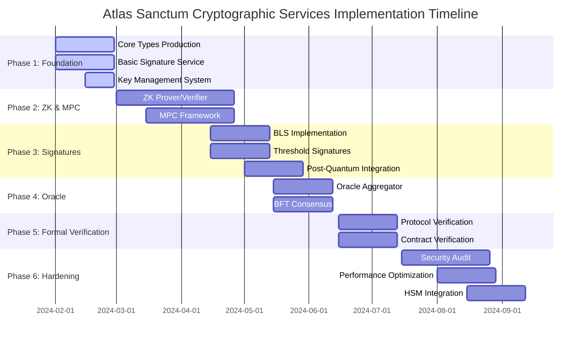
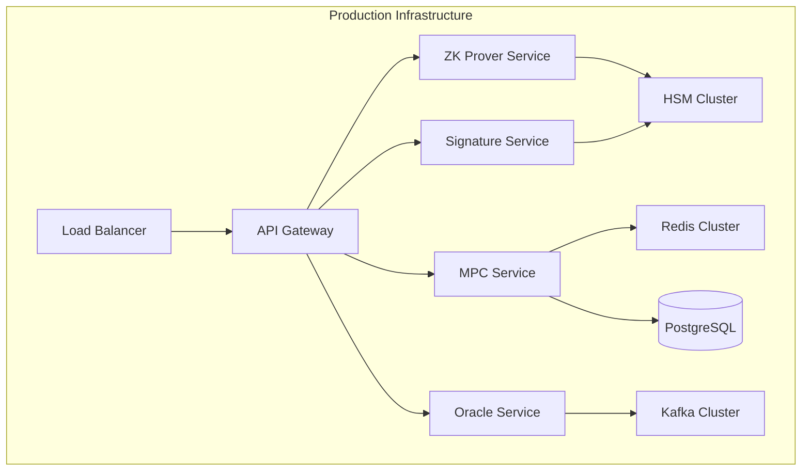
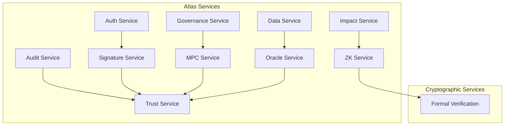
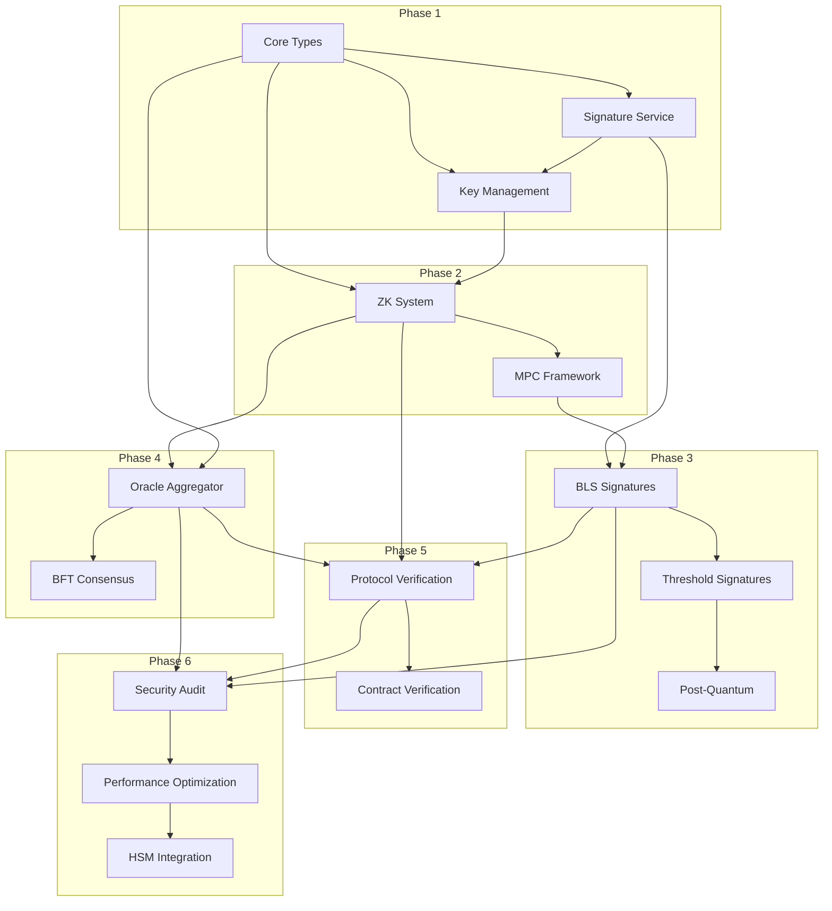

# Atlas Sanctum Cryptographic Services Implementation Plan

**Version:** 1.0.0  
**Date:** 2024-02-07  
**Classification:** Implementation Planning  
**Status:** Draft

---

## Executive Summary

This document provides a comprehensive implementation plan for the Atlas Sanctum Cryptographic Trust Framework, translating the technical specification into actionable milestones for the engineering team. The framework establishes the foundational trust infrastructure enabling Atlas to make verifiable, cryptographically-backed claims about impact, security, and compliance.

### Implementation Scope

The implementation encompasses seven core components:

| Component | Current State | Target State | Priority |
|-----------|---------------|---------------|----------|
| Cryptographic Primitives & Types | Defined | Production-Ready | Critical |
| Zero-Knowledge Proof System | Simulated | Full Implementation | Critical |
| Multi-Party Computation Protocols | Framework | Protocol Implementation | High |
| Digital Signature Schemes | Framework | Full Suite | High |
| Oracle Integrity Architecture | Framework | Production-Ready | High |
| Formal Verification System | Basic | Comprehensive | Medium |
| Trust Boundary & Decision Authority | Framework | Production-Ready | Medium |

### Key Objectives

1. **Security First**: All cryptographic implementations must meet industry security standards with third-party audits
2. **Privacy by Default**: Zero-knowledge techniques minimize information disclosure in all verification flows
3. **Distributed Trust**: No single entity controls critical cryptographic operations through MPC
4. **Future-Proofing**: Post-quantum algorithms integrated for long-term security
5. **Transparent Accountability**: All trust decisions auditable and verifiable

---

## Implementation Phases Overview



---

## Phase 1: Foundation (Weeks 1-4)

### 1.1 Core Cryptographic Types Production-Ready

**Timeline:** Weeks 1-2  
**Priority:** Critical

#### Deliverables

| Deliverable | Description | Output |
|-------------|-------------|--------|
| Type System Validation | Validate all cryptographic types against specification | Test Coverage > 95% |
| Serialization/Deserialization | Implement secure encoding for all types | Codec implementations |
| Error Handling | Standardized error codes and recovery mechanisms | Error handling framework |
| Unit Tests | Comprehensive test suite for type operations | 1000+ test cases |

#### Technical Requirements

```typescript
// Core type validation requirements
interface CryptoTypeRequirements {
  keyTypes: ['secp256k1', 'ed25519', 'bls12-381', 'mlkem768', 'mldsa44'];
  signatureTypes: ['ecdsa', 'schnorr', 'bls', 'threshold', 'pq'];
  hashAlgorithms: ['SHA-256', 'SHA3-256', 'BLAKE3', 'POSEIDON'];
  commitmentSchemes: ['Pedersen', 'KZG', 'Merkle', 'Kate'];
}
```

#### Success Criteria

- [ ] All type definitions compile without errors
- [ ] Type safety verified through exhaustive testing
- [ ] Serialization round-trip tests pass
- [ ] Error code documentation complete

#### Dependencies

- None (Foundation phase)

#### Risk Factors

| Risk | Impact | Probability | Mitigation |
|------|--------|-------------|------------|
| Type definition gaps | High | Low | Specification review |
| Performance issues | Medium | Low | Benchmarking during development |

---

### 1.2 Basic Signature Service Implementation

**Timeline:** Weeks 2-3  
**Priority:** Critical

#### Deliverables

| Deliverable | Description | Output |
|-------------|-------------|--------|
| ECDSA Implementation | Standard elliptic curve signatures | Service implementation |
| Ed25519 Implementation | High-performance signatures | Service implementation |
| Key Generation | Secure random key generation | Key generation service |
| Signature Verification | Batch verification support | Verification service |

#### Technical Requirements

```typescript
interface SignatureServiceRequirements {
  ecdsa: {
    curve: 'secp256k1' | 'P-256' | 'P-384' | 'P-521';
    hash: 'SHA-256' | 'SHA-384' | 'SHA-512';
    deterministic: boolean;
  };
  ed25519: {
    context: boolean | string;
    hash: 'SHA-512';
  };
  batchVerification: {
    maxBatchSize: number;
    parallelProcessing: boolean;
  };
}
```

#### Integration Points

- [`AtlasSanctumCryptoTypes.ts`](src/architecture/AtlasSanctumCryptoTypes.ts:104) - CryptoSignature interface
- [`AtlasSanctumSignatures.ts`](src/architecture/AtlasSanctumSignatures.ts:49) - ISignatureService

#### Success Criteria

- [ ] ECDSA implementation passes test vectors
- [ ] Ed25519 implementation verified against RFC 8032
- [ ] Key generation uses cryptographically secure RNG
- [ ] Batch verification achieves 10x speedup over individual

---

### 1.3 Key Management System

**Timeline:** Weeks 3-4  
**Priority:** Critical

#### Deliverables

| Deliverable | Description | Output |
|-------------|-------------|--------|
| Key Storage | Secure key storage with encryption | Key vault service |
| Key Rotation | Automated and manual rotation | Rotation policies |
| Key Derivation | HD key derivation (BIP-32/BIP-44) | Derivation service |
| Key Revocation | Revocation list management | Revocation service |

#### Technical Requirements

```typescript
interface KeyManagementRequirements {
  storage: {
    encryption: 'AES-256-GCM';
    keyWrapping: 'RSA-OAEP' | 'ECIES';
    hardwareModule: 'PKCS#11' | 'CloudHSM' | 'AWS-KMS';
  };
  rotation: {
    automatic: boolean;
    intervalDays: number;
    notifyBeforeDays: number;
    emergencyRotation: boolean;
  };
  derivation: {
    standards: ['BIP-32', 'BIP-44', 'BIP-49', 'SLIP-44'];
    purpose: number;
    coin: number;
  };
}
```

#### Success Criteria

- [ ] Keys encrypted at rest with AES-256-GCM
- [ ] Rotation policies enforced automatically
- [ ] Derivation paths validated against BIP specification
- [ ] Revocation propagation < 1 second

---

## Phase 2: Advanced ZK & MPC (Weeks 5-8)

### 2.1 Zero-Knowledge Proof System Implementation

**Timeline:** Weeks 5-6  
**Priority:** Critical

#### Deliverables

| Deliverable | Description | Output |
|-------------|-------------|--------|
| Groth16 Implementation | Short proofs with trusted setup | ZK prover/verifier |
| PLONK Implementation | Universal trusted setup | ZK prover/verifier |
| Halo2 Implementation | Recursive proofs, no setup | ZK prover/verifier |
| Nova Implementation | Incrementally computable proofs | ZK prover/verifier |

#### Technical Requirements

```typescript
interface ZKProofSystemRequirements {
  groth16: {
    proofSize: '192 bytes';
    verificationTime: '<10ms';
    trustedSetup: 'PerpetualPowersOfTau';
    securityLevel: 128;
  };
  plonk: {
    proofSize: '400 bytes';
    verificationTime: '<50ms';
    trustedSetup: 'Universal';
    securityLevel: 128;
  };
  halo2: {
    proofSize: '1KB';
    verificationTime: '<100ms';
    trustedSetup: 'Transparent';
    recursive: true;
  };
  nova: {
    proofSize: '2KB';
    verificationTime: '<50ms';
    incremental: true;
  };
}
```

#### Integration Points

- [`AtlasSanctumZeroKnowledge.ts`](src/architecture/AtlasSanctumZeroKnowledge.ts:305) - IZKProver interface
- [`AtlasSanctumZeroKnowledge.ts`](src/architecture/AtlasSanctumZeroKnowledge.ts:315) - IZKVerifier interface

#### Success Criteria

- [ ] All proof systems pass conformance tests
- [ ] Proof generation times meet benchmarks
- [ ] Batch verification implemented
- [ ] Circuit compiler produces valid R1CS/WASM

---

### 2.2 Predefined Circuit Templates

**Timeline:** Weeks 6-7  
**Priority:** High

#### Deliverables

| Deliverable | Description | Output |
|-------------|-------------|--------|
| Range Proof Circuit | Prove value within range | Circuit implementation |
| Membership Proof Circuit | Prove element in Merkle set | Circuit implementation |
| Impact Verification Circuit | Regenerative impact claims | Circuit implementation |
| Credential Proof Circuit | Attribute-based credentials | Circuit implementation |

#### Technical Requirements

```typescript
interface CircuitRequirements {
  impactVerification: {
    inputs: {
      public: ['claim_id', 'timestamp', 'location', 'metric_type', 'value'];
      private: ['sensor_data', 'calculation_proof', 'attestations'];
    };
    constraints: number;
    gates: number;
  };
  rangeProof: {
    maxBits: number;
    constraints: 'O(log maxBits)';
  };
}
```

#### Success Criteria

- [ ] Impact circuit handles 1000+ constraint proofs
- [ ] Range proof verified in < 5ms
- [ ] Membership proof with 20-depth Merkle tree

---

### 2.3 Multi-Party Computation Framework

**Timeline:** Weeks 7-8  
**Priority:** High

#### Deliverables

| Deliverable | Description | Output |
|-------------|-------------|--------|
| Shamir Secret Sharing | Basic threshold scheme | SSS implementation |
| SPDZ Protocol | Malicious-secure computation | SPDZ implementation |
| FROST Integration | Flexible round-optimized signatures | FROST implementation |
| GG18 Protocol | Threshold ECDSA | GG18 implementation |

#### Technical Requirements

```typescript
interface MPCRequirements {
  shamir: {
    field: 'GF(256)' | 'GF(2^32)' | 'BN254';
    sharing: 'Additive' | 'Polynomial';
  };
  spdz: {
    modulus: 'prime' | '2^k';
    preprocessing: ' Beaver triples';
    security: 'malicious';
  };
  frost: {
    rounds: 2 | 3;
    threshold: 't-of-n';
    parallel: boolean;
  };
}
```

#### Integration Points

- [`AtlasSanctumMPC.ts`](src/architecture/AtlasSanctumMPC.ts:38) - IMPCSessionManager interface
- [`AtlasSanctumMPC.ts`](src/architecture/AtlasSanctumMPC.ts:276) - IThresholdSignatureService

#### Success Criteria

- [ ] FROST signing completes with 3 parties in < 1s
- [ ] SPDZ computation verifiable
- [ ] GG18 threshold signing working

---

## Phase 3: Signature Schemes (Weeks 9-12)

### 3.1 BLS Signature Implementation

**Timeline:** Week 9  
**Priority:** High

#### Deliverables

| Deliverable | Description | Output |
|-------------|-------------|--------|
| BLS12-381 Curves | G1/G2 point operations | Core library |
| Signature Aggregation | Multi-signature aggregation | Aggregation service |
| Proof of Possession | Anti-Sybil aggregation | POP implementation |
| Threshold BLS | T-of-N BLS signatures | Threshold service |

#### Technical Requirements

```typescript
interface BLSRequirements {
  curve: 'BLS12-381';
  schemes: ['basic', 'messageAugmentation', 'proofOfPossession'];
  pointCompression: boolean;
  aggregation: {
    parallel: boolean;
    maxSigners: number;
  };
}
```

#### Success Criteria

- [ ] BLS operations pass test vectors
- [ ] Aggregation reduces signature size by 50%+
- [ ] POP prevents rogue key attacks

---

### 3.2 Threshold Signature Service

**Timeline:** Weeks 9-10  
**Priority:** High

#### Deliverables

| Deliverable | Description | Output |
|-------------|-------------|--------|
| FROST Signing | Distributed threshold signing | Signing service |
| Key Share Management | Share generation and distribution | Management service |
| Resharing Protocol | Dynamic threshold adjustment | Resharing service |
| Partial Combination | Signature reconstruction | Combination service |

#### Success Criteria

- [ ] 2-of-3 threshold signing functional
- [ ] Resharing preserves security properties
- [ ] Identifiable aborts for malicious parties

---

### 3.3 Post-Quantum Signature Integration

**Timeline:** Weeks 11-12  
**Priority:** Medium

#### Deliverables

| Deliverable | Description | Output |
|-------------|-------------|--------|
| ML-DSA Implementation | NIST Level 2-5 signatures | PQ signature service |
| SPHINCS+ Integration | Stateless hash-based signatures | PQ signature service |
| Falcon Implementation | FFT-based signatures | PQ signature service |
| Hybrid Signatures | Classic + PQ combination | Hybrid service |

#### Technical Requirements

```typescript
interface PostQuantumRequirements {
  mlDsa: {
    variants: ['ML-DSA-44', 'ML-DSA-65', 'ML-DSA-87'];
    securityLevels: [2, 3, 5];
  };
  sphincsPlus: {
    hash: 'SHAKE256' | 'BLAKE3';
    variants: ['SHA', 'SHAKE'];
  };
  hybrid: {
    classicAlgorithm: 'ECDSA' | 'Ed25519';
    pqAlgorithm: 'ML-DSA' | 'SPHINCS+';
    combination: 'AND' | 'OR' | 'Sequential';
  };
}
```

#### Success Criteria

- [ ] ML-DSA passes NIST submission test vectors
- [ ] SPHINCS+ signature verification functional
- [ ] Hybrid signatures interoperable

---

## Phase 4: Oracle Integrity (Weeks 13-16)

### 4.1 Oracle Aggregator Production

**Timeline:** Weeks 13-14  
**Priority:** High

#### Deliverables

| Deliverable | Description | Output |
|-------------|-------------|--------|
| Data Source Integration | Satellite, sensor, API sources | Integration adapters |
| Aggregation Strategies | Weighted mean, median, trimmed mean | Aggregation service |
| Outlier Detection | Z-score, IQR, MAD methods | Detection service |
| Confidence Scoring | Source reliability scoring | Confidence service |

#### Technical Requirements

```typescript
interface OracleAggregatorRequirements {
  sources: {
    satellite: ['Sentinel', 'Landsat', 'Planet'];
    sensor: ['soil', 'bioacoustic', 'air_quality', 'water'];
    manual: ['ground_truth', 'expert_report'];
  };
  aggregation: {
    methods: ['weighted_mean', 'median', 'trimmed_mean', 'winsorized_mean'];
    outlierDetection: ['none', 'zscore', 'iqr', 'mad'];
  };
  confidence: {
    sourceWeight: boolean;
    temporalDecay: boolean;
  };
}
```

#### Integration Points

- [`AtlasSanctumOracleIntegrity.ts`](src/architecture/AtlasSanctumOracleIntegrity.ts:93) - IOracleAggregator interface

#### Success Criteria

- [ ] 10+ data sources integrated
- [ ] Aggregation completes < 1 second
- [ ] Outlier detection accuracy > 95%

---

### 4.2 Byzantine Fault Tolerance

**Timeline:** Weeks 14-15  
**Priority:** High

#### Deliverables

| Deliverable | Description | Output |
|-------------|-------------|--------|
| 3f+1 Consensus | Byzantine fault tolerant agreement | Consensus service |
| Dispute Resolution | Voting and authoritative resolution | Dispute service |
| Slash Conditions | Malicious oracle detection | Slashing service |
| Governance | Oracle set management | Governance service |

#### Technical Requirements

```typescript
interface BFTRequirements {
  minOracles: 4;  // 3f+1 formula
  maxByzantine: 1;
  consensusThreshold: number;
  disputeResolution: {
    voting: boolean;
    random: boolean;
    authoritative: boolean;
  };
}
```

#### Success Criteria

- [ ] Consensus reached with 1 faulty oracle
- [ ] Dispute resolution < 5 minutes
- [ ] Slash conditions enforced

---

### 4.3 Oracle Attestation Service

**Timeline:** Weeks 15-16  
**Priority:** High

#### Deliverables

| Deliverable | Description | Output |
|-------------|-------------|--------|
| Data Point Signing | Oracle-signed data attestations | Signing service |
| Chain of Trust | Hierarchical attestation chain | Trust chain service |
| Batch Attestation | Multi-point batch attestation | Batch service |
| Verification Service | Attestation verification | Verification service |

#### Success Criteria

- [ ] All attestations verifiable
- [ ] Chain of trust depth > 5
- [ ] Batch attestation 5x faster than individual

---

## Phase 5: Formal Verification (Weeks 17-20)

### 5.1 Protocol Verification System

**Timeline:** Weeks 17-18  
**Priority:** Medium

#### Deliverables

| Deliverable | Description | Output |
|-------------|-------------|--------|
| TLA+ Integration | Temporal logic specifications | TLA+ verifier |
| Property Verification | Safety/liveness/fairness checks | Property checker |
| Model Checking | State space exploration | Model checker |
| Proof Generation | Interactive proof assistance | Proof assistant |

#### Technical Requirements

```typescript
interface ProtocolVerificationRequirements {
  modes: ['model_checking', 'theorem_proving', 'symbolic_execution', 'type_theory'];
  properties: {
    safety: 'No bad states reachable';
    liveness: 'Something good eventually happens';
    fairness: 'No process starves indefinitely';
    security: 'Adversary cannot violate invariants';
  };
  tools: ['TLA+', 'Coq', 'Isabelle', 'F*'];
}
```

#### Integration Points

- [`AtlasSanctumFormalVerification.ts`](src/architecture/AtlasSanctumFormalVerification.ts:60) - IFormalVerificationService

#### Success Criteria

- [ ] MPC protocol verified for safety properties
- [ ] ZK protocol verified for soundness
- [ ] Threshold scheme verified for correctness

---

### 5.2 Smart Contract Verification

**Timeline:** Weeks 18-19  
**Priority:** Medium

#### Deliverables

| Deliverable | Description | Output |
|-------------|-------------|--------|
| Solidity Verification | EVM contract analysis | Solidity verifier |
| Rust Verification | SVM contract analysis | Rust verifier |
| Property Specification | Formal contract specs | Spec language |
| Gas Optimization | Verified gas bounds | Optimization service |

#### Technical Requirements

```typescript
interface ContractVerificationRequirements {
  languages: ['Solidity', 'Rust', 'Move'];
  verification: {
    preconditions: boolean;
    postconditions: boolean;
    invariants: boolean;
    reentrancy: boolean;
    overflow: boolean;
  };
  standards: ['ERC-20', 'ERC-721', 'ERC-1155'];
}
```

#### Success Criteria

- [ ] All contracts verified before deployment
- [ ] No reentrancy vulnerabilities in verified code
- [ ] Gas bounds proven

---

### 5.3 Invariant Monitoring

**Timeline:** Weeks 19-20  
**Priority:** Medium

#### Deliverables

| Deliverable | Description | Output |
|-------------|-------------|--------|
| Runtime Monitoring | Continuous invariant checking | Monitor service |
| Violation Alerts | Real-time violation notifications | Alert service |
| Recovery Procedures | Automatic recovery mechanisms | Recovery service |
| Audit Logging | Comprehensive invariant logging | Audit service |

#### Success Criteria

- [ ] All critical invariants monitored
- [ ] Violation detection < 100ms
- [ ] Recovery procedures tested

---

## Phase 6: Production Hardening (Weeks 21-24)

### 6.1 Security Audit

**Timeline:** Weeks 21-22  
**Priority:** Critical

#### Deliverables

| Deliverable | Description | Output |
|-------------|-------------|--------|
| Third-Party Audit | Professional security audit | Audit report |
| Penetration Testing | Red team engagement | Pen test report |
| Cryptographic Review | Algorithm implementation review | Crypto review |
| Dependency Audit | Supply chain security scan | Dependency report |

#### Success Criteria

- [ ] No critical vulnerabilities
- [ ] All high vulnerabilities remediated
- [ ] Audit report published

---

### 6.2 Performance Optimization

**Timeline:** Weeks 22-23  
**Priority:** High

#### Deliverables

| Deliverable | Description | Output |
|-------------|-------------|--------|
| ZK Proof Acceleration | GPU-based proving | CUDA/WebGPU backend |
| Signature Batching | Parallel signature verification | Batch verifier |
| Caching Layer | Proof/verification caching | Cache service |
| Load Testing | 10x expected load testing | Load test report |

#### Performance Benchmarks

| Operation | Target Time | Throughput |
|-----------|-------------|------------|
| ZK Proof Generation | < 5s | 10 proofs/min |
| ZK Verification | < 10ms | 100 verifications/sec |
| Signature Verification | < 1ms | 10,000 verifications/sec |
| MPC Signing | < 500ms | 100 signings/sec |

---

### 6.3 Hardware Security Module Integration

**Timeline:** Weeks 23-24  
**Priority:** High

#### Deliverables

| Deliverable | Description | Output |
|-------------|-------------|--------|
| HSM Integration | Cloud/on-premise HSM support | HSM adapter |
| Key Ceremony | Secure key generation ceremony | Ceremony protocol |
| Failover | Multi-HSM redundancy | Failover service |
| Monitoring | HSM health monitoring | Monitoring dashboard |

#### Technical Requirements

```typescript
interface HSMRequirements {
  providers: ['AWS CloudHSM', 'Azure Dedicated HSM', 'Google Cloud HSM', 'Thales', 'Utimaco'];
  protocols: ['PKCS#11', 'KMIP', 'native API'];
  failover: {
    activePassive: boolean;
    failoverTime: '< 100ms';
  };
  compliance: ['FIPS 140-2 Level 3', 'FIPS 140-3 Level 4'];
}
```

#### Success Criteria

- [ ] All root keys in HSM
- [ ] Failover tested and working
- [ ] FIPS 140-2 compliance verified

---

## Resource Requirements

### Team Composition

| Role | Phase 1 | Phase 2 | Phase 3 | Phase 4 | Phase 5 | Phase 6 |
|------|---------|---------|---------|---------|---------|---------|
| Cryptography Engineer | 2 | 2 | 2 | 1 | 1 | 1 |
| Security Engineer | 0 | 0 | 1 | 1 | 1 | 2 |
| Backend Engineer | 1 | 1 | 1 | 1 | 1 | 1 |
| DevOps Engineer | 0 | 0 | 0 | 0 | 1 | 1 |
| QA Engineer | 0 | 0 | 0 | 0 | 0 | 1 |

### External Dependencies

| Dependency | Purpose | License | Criticality |
|------------|---------|---------|-------------|
| arkworks | ZK proving systems | Apache 2.0 | Critical |
| bls12-381 | BLS curve operations | Apache 2.0 | Critical |
| sha3 | SHA-3 implementation | MIT | High |
| libsodium | General cryptography | ISC | High |
| curve25519-dalek | Elliptic curve operations | BSD | High |
| circom | Circuit compiler | MIT | Medium |
| snarkjs | ZK proof generation | GPL-3.0 | Medium |

### Hardware Requirements

| Hardware | Quantity | Purpose | Specifications |
|----------|----------|---------|----------------|
| HSM | 4 units | Key storage | FIPS 140-2 Level 3 |
| GPU Server | 2 units | ZK proving | NVIDIA A100, 80GB |
| Benchmark Server | 1 unit | Performance testing | 128 cores, 512GB RAM |
| Staging Environment | 1 unit | Integration testing | Full production mirror |

### Infrastructure Requirements



---

## Risk Assessment Matrix

### Technical Risks

| Risk | Impact | Probability | Severity | Mitigation |
|------|--------|-------------|----------|------------|
| ZK proving too slow | High | Medium | Critical | GPU acceleration, circuit optimization |
| MPC party drops | Medium | Medium | High | Timeout handling, recovery protocol |
| Quantum attack | Low | Low | Critical | Post-quantum algorithms ready |
| Side-channel attacks | High | Low | Critical | Constant-time implementations, masking |
| Trusted setup compromise | High | Low | Critical | Multi-party ceremony, transparent setups |

### Timeline Risks

| Risk | Impact | Probability | Mitigation |
|------|--------|-------------|------------|
| Scope creep | High | Medium | Strict change control |
| Team availability | Medium | Medium | Cross-training, documentation |
| Dependency delays | Medium | Low | Alternative implementations ready |
| Integration complexity | High | Medium | Early integration testing |

### Resource Risks

| Risk | Impact | Probability | Mitigation |
|------|--------|-------------|------------|
| Hiring delays | High | Medium | Contract-to-hire pipeline |
| Budget constraints | High | Low | Phased implementation |
| Tool licensing | Medium | Low | Open-source first strategy |

### External Dependencies

| Dependency | Risk | Probability | Mitigation |
|------------|------|-------------|------------|
| arkworks updates | Breaking changes | Low | Fork and maintain critical parts |
| HSM availability | Supply chain | Low | Multi-vendor strategy |
| Regulatory changes | Policy changes | Medium | Compliance-first design |

---

## Quality Assurance Plan

### Security Audit Strategy

1. **Pre-Implementation**
   - Code review by senior cryptographers
   - Threat modeling session
   - Design security review

2. **During Implementation**
   - Static analysis (SonarQube, CodeQL)
   - Dependency scanning (Snyk, OWASP)
   - Unit test coverage > 90%

3. **Pre-Launch**
   - Third-party penetration test
   - Cryptographic implementation audit
   - Social engineering test

### Testing Coverage Requirements

| Component | Unit Tests | Integration Tests | E2E Tests |
|-----------|------------|-------------------|-----------|
| Cryptographic Primitives | 100% | 100% | N/A |
| ZK Proof System | 95% | 90% | 80% |
| MPC Protocols | 90% | 85% | 75% |
| Signature Schemes | 100% | 100% | 90% |
| Oracle Integrity | 90% | 85% | 80% |
| Formal Verification | 80% | 70% | 60% |

### Code Review Process


### Performance Benchmarks

| Operation | P50 | P95 | P99 |
|-----------|-----|-----|-----|
| ZK Proof Generation | 2s | 4s | 5s |
| ZK Verification | 5ms | 8ms | 10ms |
| Signature Signing | 1ms | 2ms | 5ms |
| Signature Verification | 0.5ms | 1ms | 2ms |
| MPC Key Gen | 500ms | 1s | 2s |
| MPC Signing | 200ms | 500ms | 1s |

---

## Integration Roadmap

### Existing Atlas Services Integration



### API Design Principles

1. **Versioning**: Semantic versioning (v1, v2, etc.)
2. **Backward Compatibility**: Minimum 2 major versions
3. **Deprecation Policy**: 6-month deprecation notice
4. **Documentation**: OpenAPI 3.0 specs for all APIs

### Migration Strategy

| Phase | Action | Rollback Plan |
|-------|--------|---------------|
| Canary | 1% traffic to new service | Immediate rollback |
| Blue-Green | Full traffic switch | Instant switch back |
| Monitoring | 24-hour observation | Manual intervention |
| Cleanup | Remove old service | Re-deploy if needed |

---

## Dependencies Between Milestones



---

## Success Metrics

### Technical Metrics

| Metric | Target | Measurement |
|--------|--------|-------------|
| ZK Proof Generation Time | < 5s | P95 latency |
| Signature Verification Rate | 10,000/sec | Throughput |
| MPC Signing Time | < 500ms | P95 latency |
| System Uptime | 99.99% | Availability |
| Audit Coverage | 100% | Code coverage |

### Business Metrics

| Metric | Target | Measurement |
|--------|--------|-------------|
| Security Incidents | 0 | Per quarter |
| Time to Remediation | < 24h | Vulnerability fixes |
| Audit Findings | < 5 | Per audit |
| Compliance Score | 100% | Internal assessment |

---

## Appendix A: Glossary

| Term | Definition |
|------|------------|
| BLS | Boneh-Lynn-Shacham signature scheme |
| FROST | Flexible Round-Optimized Schnorr Threshold |
| Groth16 | Short proof zk-SNARK |
| HSM | Hardware Security Module |
| MPC | Multi-Party Computation |
| PLONK | Permutable with Lookup Arguments over Non-Interactive Arguments of Knowledge |
| ZK | Zero-Knowledge |
| ZKP | Zero-Knowledge Proof |

## Appendix B: Reference Documents

1. [`ATLAS_SANCTUM_CRYPTOGRAPHIC_TRUST_SPECIFICATION.md`](docs/ATLAS_SANCTUM_CRYPTOGRAPHIC_TRUST_SPECIFICATION.md) - Technical specification
2. [`AtlasSanctumCryptoTypes.ts`](src/architecture/AtlasSanctumCryptoTypes.ts) - Core types
3. [`AtlasSanctumZeroKnowledge.ts`](src/architecture/AtlasSanctumZeroKnowledge.ts) - ZK implementation
4. [`AtlasSanctumMPC.ts`](src/architecture/AtlasSanctumMPC.ts) - MPC implementation
5. [`AtlasSanctumSignatures.ts`](src/architecture/AtlasSanctumSignatures.ts) - Signature implementations
6. [`AtlasSanctumOracleIntegrity.ts`](src/architecture/AtlasSanctumOracleIntegrity.ts) - Oracle integrity
7. [`AtlasSanctumFormalVerification.ts`](src/architecture/AtlasSanctumFormalVerification.ts) - Formal verification
8. [`AtlasSanctumTrustBoundary.ts`](src/architecture/AtlasSanctumTrustBoundary.ts) - Trust boundaries

---

**Document Classification:** Implementation Planning  
**Review Cycle:** Bi-weekly during implementation  
**Owner:** Chief Cryptographic & Trust Engineer  
**Approver:**待批准
