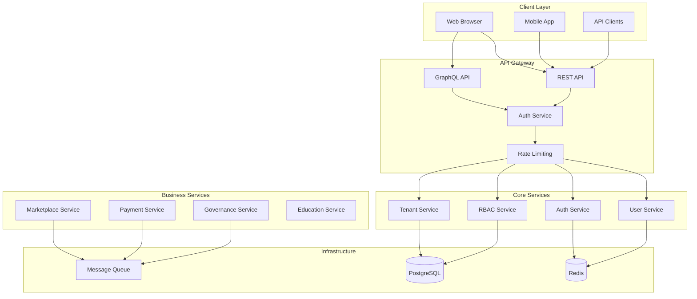

# Backend Architecture Design Document

## Executive Summary

This document outlines a comprehensive backend architecture for a multi-tenant platform supporting secure, scalable API endpoints using both REST and GraphQL patterns. The architecture implements a microservice-oriented decomposition with clear service boundaries and robust authentication/authorization mechanisms.

## Table of Contents

1. [System Overview](#system-overview)
2. [Service Boundaries](#service-boundaries)
3. [Authentication Framework](#authentication-framework)
4. [Authorization System](#authorization-system)
5. [Multi-Tenancy](#multi-tenancy)
6. [Type System](#type-system)
7. [API Design](#api-design)
8. [Inter-Service Communication](#inter-service-communication)
9. [Security](#security)
10. [Implementation Roadmap](#implementation-roadmap)

---

## System Overview

### High-Level Architecture



### Technology Stack

| Layer | Technology | Purpose |
|-------|------------|---------|
| Runtime | Node.js 20+ | JavaScript runtime |
| Framework | Express.js | REST API framework |
| Language | TypeScript 5.x | Type safety |
| Database | PostgreSQL 15 | Primary data store |
| Cache | Redis 7 | Sessions, caching |
| Queue | RabbitMQ/Redis | Message queuing |
| ORM | Prisma/Drizzle | Database ORM |
| Auth | Passport.js | OAuth integration |
| JWT | jsonwebtoken | Token handling |

---

## Service Boundaries

### Core Services

#### 1. User Service (`users/`)

**Responsibilities:**
- User lifecycle management
- Profile management
- User search and listing
- User preferences

**Data Model:**
```typescript
interface User {
  id: string;
  email: string;
  phoneNumber?: string;
  displayName: string;
  avatarUrl?: string;
  role: string;
  tenantId: string;
  organizationId?: string;
  emailVerified: boolean;
  phoneVerified: boolean;
  mfaEnabled: boolean;
  mfaSecret?: string;
  lastLogin?: Date;
  createdAt: Date;
  updatedAt: Date;
}
```

#### 2. Authentication Service (`auth/`)

**Responsibilities:**
- Session management
- JWT token issuance
- OAuth provider integration
- MFA verification
- Password management

**Key Components:**
```typescript
interface Session {
  id: string;
  userId: string;
  token: string;
  refreshToken: string;
  expiresAt: Date;
  ipAddress: string;
  userAgent: string;
  deviceFingerprint: string;
}

interface TokenPayload {
  sub: string;          // User ID
  email: string;
  role: string;
  tenantId: string;
  organizationId?: string;
  permissions: string[];
  sessionId: string;
  iat: number;
  exp: number;
}
```

#### 3. RBAC Service (`rbac/`)

**Responsibilities:**
- Role hierarchy management
- Permission assignment
- Capability checks
- Policy enforcement

**Role Hierarchy:**
```typescript
const ROLE_HIERARCHY = {
  'super_admin': 100,
  'tenant_admin': 80,
  'organization_admin': 60,
  'moderator': 40,
  'manager': 30,
  'member': 20,
  'guest': 10
} as const;

const ROLE_CAPABILITIES = {
  'super_admin': ['*'],  // All capabilities
  'tenant_admin': [
    'users:read', 'users:write', 'users:delete',
    'organizations:manage',
    'billing:read', 'billing:write'
  ],
  'organization_admin': [
    'users:read', 'users:invite',
    'projects:read', 'projects:write',
    'billing:read'
  ],
  'member': [
    'projects:read',
    'own:profile:read', 'own:profile:write'
  ]
};
```

#### 4. Tenant Service (`tenants/`)

**Responsibilities:**
- Tenant lifecycle
- Tenant settings
- Organization management
- Tenant isolation

---

## Authentication Framework

### Session-Based Authentication

```typescript
// Express middleware for session authentication
interface SessionAuthOptions {
  cookie: boolean;
  sessionHeader: boolean;
  failOnMissing: boolean;
}

const createSessionAuth = (options: SessionAuthOptions) => {
  return async (req: Request, res: Response, next: NextFunction) => {
    // Try session cookie first
    if (options.cookie && req.session?.userId) {
      const session = await redisClient.get(`session:${req.session.id}`);
      if (session) {
        req.user = JSON.parse(session);
        return next();
      }
    }
    
    // Try X-Session-ID header
    if (options.sessionHeader) {
      const sessionId = req.headers['x-session-id'];
      if (sessionId && typeof sessionId === 'string') {
        const session = await redisClient.get(`session:${sessionId}`);
        if (session) {
          req.user = JSON.parse(session);
          return next();
        }
      }
    }
    
    if (options.failOnMissing) {
      return res.status(401).json({
        error: 'UNAUTHORIZED',
        message: 'Valid session required'
      });
    }
    
    next();
  };
};
```

### JWT-Based Authentication

```typescript
// JWT Token types
interface JWTTokens {
  accessToken: string;
  refreshToken: string;
  expiresIn: number;
}

class JWTService {
  private accessSecret: string;
  private refreshSecret: string;
  private accessExpiry = '15m';
  private refreshExpiry = '7d';
  
  generateTokens(payload: Omit<TokenPayload, 'iat' | 'exp'>): JWTTokens {
    const accessToken = jwt.sign(
      { ...payload, type: 'access' },
      this.accessSecret,
      { expiresIn: this.accessExpiry }
    );
    
    const refreshToken = jwt.sign(
      { ...payload, type: 'refresh' },
      this.refreshSecret,
      { expiresIn: this.refreshExpiry }
    );
    
    return {
      accessToken,
      refreshToken,
      expiresIn: 900 // 15 minutes
    };
  }
  
  verifyAccessToken(token: string): TokenPayload | null {
    try {
      return jwt.verify(token, this.accessSecret) as TokenPayload;
    } catch {
      return null;
    }
  }
  
  refreshTokens(refreshToken: string): JWTTokens | null {
    try {
      const payload = jwt.verify(
        refreshToken,
        this.refreshSecret
      ) as TokenPayload & { type: 'refresh' };
      
      if (payload.type !== 'refresh') {
        return null;
      }
      
      return this.generateTokens({
        sub: payload.sub,
        email: payload.email,
        role: payload.role,
        tenantId: payload.tenantId,
        organizationId: payload.organizationId,
        permissions: payload.permissions,
        sessionId: payload.sessionId
      });
    } catch {
      return null;
    }
  }
}
```

### OAuth Integration

```typescript
// Passport.js configuration
import { Strategy as GoogleStrategy } from 'passport-google-oauth20';
import { Strategy as GitHubStrategy } from 'passport-github2';

const passportConfig = (passport: Passport) => {
  // Google OAuth
  passport.use(new GoogleStrategy({
    clientID: process.env.GOOGLE_CLIENT_ID!,
    clientSecret: process.env.GOOGLE_CLIENT_SECRET!,
    callbackURL: '/api/auth/google/callback',
    scope: ['profile', 'email']
  }, async (accessToken, refreshToken, profile, done) => {
    // Find or create user
    const user = await userService.findOrCreateFromOAuth({
      provider: 'google',
      providerId: profile.id,
      email: profile.emails?.[0]?.value,
      displayName: profile.displayName
    });
    done(null, user);
  }));
  
  // Session serialization
  passport.serializeUser((user, done) => {
    done(null, user.id);
  });
  
  passport.deserializeUser(async (id, done) => {
    const user = await userService.findById(id);
    done(null, user);
  });
};
```

### Combined Auth Middleware

```typescript
// Hybrid authentication - accepts session cookie OR bearer token
const hybridAuth = async (req: Request, res: Response, next: NextFunction) => {
  // Try Bearer token first (API clients)
  const authHeader = req.headers.authorization;
  if (authHeader?.startsWith('Bearer ')) {
    const token = authHeader.substring(7);
    const payload = jwtService.verifyAccessToken(token);
    if (payload) {
      req.user = payload;
      req.authMethod = 'jwt';
      return next();
    }
  }
  
  // Try session cookie
  if (req.session?.userId) {
    const session = await redisClient.get(`session:${req.session.id}`);
    if (session) {
      req.user = JSON.parse(session);
      req.authMethod = 'session';
      return next();
    }
  }
  
  // Try X-Session-ID header
  const sessionId = req.headers['x-session-id'];
  if (sessionId && typeof sessionId === 'string') {
    const session = await redisClient.get(`session:${sessionId}`);
    if (session) {
      req.user = JSON.parse(session);
      req.authMethod = 'session';
      return next();
    }
  }
  
  return res.status(401).json({
    error: 'UNAUTHORIZED',
    message: 'Authentication required'
  });
};
```

---

## Authorization System

### RBAC Middleware

```typescript
// Hierarchical role checking
const requireRole = (...allowedRoles: string[]) => {
  return (req: Request, res: Response, next: NextFunction) => {
    if (!req.user) {
      return res.status(401).json({
        error: 'UNAUTHORIZED',
        message: 'Authentication required'
      });
    }
    
    const userRoleLevel = ROLE_HIERARCHY[req.user.role as keyof typeof ROLE_HIERARCHY] || 0;
    
    const hasAccess = allowedRoles.some(role => {
      const roleLevel = ROLE_HIERARCHY[role as keyof typeof ROLE_HIERARCHY] || 0;
      return userRoleLevel >= roleLevel;
    });
    
    if (!hasAccess) {
      return res.status(403).json({
        error: 'FORBIDDEN',
        message: 'Insufficient permissions'
      });
    }
    
    next();
  };
};

// Capability-based checking
const requireCapability = (...capabilities: string[]) => {
  return async (req: Request, res: Response, next: NextFunction) => {
    const userPermissions = req.user?.permissions || [];
    
    // Super admin bypass
    if (userPermissions.includes('*')) {
      return next();
    }
    
    const hasAll = capabilities.every(cap => 
      userPermissions.includes(cap)
    );
    
    if (!hasAll) {
      return res.status(403).json({
        error: 'FORBIDDEN',
        message: `Required capabilities: ${capabilities.join(', ')}`
      });
    }
    
    next();
  };
};

// Resource ownership checking
const requireOwnership = (getOwnerId: (req: Request) => Promise<string>) => {
  return async (req: Request, res: Response, next: NextFunction) => {
    const resourceOwnerId = await getOwnerId(req);
    
    // Check ownership
    if (resourceOwnerId === req.user?.sub) {
      return next();
    }
    
    // Check if user has elevated permissions
    const userRoleLevel = ROLE_HIERARCHY[req.user?.role] || 0;
    if (userRoleLevel >= ROLE_HIERARCHY.moderator) {
      return next();
    }
    
    return res.status(403).json({
      error: 'FORBIDDEN',
      message: 'You do not have access to this resource'
    });
  };
};
```

### Tenant Isolation Middleware

```typescript
// Tenant context
interface TenantContext {
  tenantId: string;
  organizationId?: string;
  userId: string;
  role: string;
}

// Set tenant context from JWT
const setTenantContext = (req: Request, res: Response, next: NextFunction) => {
  if (req.user) {
    req.tenantContext = {
      tenantId: req.user.tenantId,
      organizationId: req.user.organizationId,
      userId: req.user.sub,
      role: req.user.role
    };
  }
  next();
};

// Database query tenant isolation
const withTenantIsolation = (query: string, params: any[]) => {
  // Inject tenant_id filter for tables that require it
  // This ensures all queries are scoped to the tenant
  return {
    ...query,
    tenantFilter: 'AND tenant_id = $CURRENT_TENANT'
  };
};
```

---

## Multi-Tenancy

### Tenant Model

```typescript
interface Tenant {
  id: string;
  name: string;
  slug: string;
  plan: 'free' | 'starter' | 'professional' | 'enterprise';
  settings: TenantSettings;
  limits: TenantLimits;
  status: 'active' | 'suspended' | 'deleted';
  createdAt: Date;
  updatedAt: Date;
}

interface TenantSettings {
  allowOAuth: boolean;
  requireMFA: boolean;
  sessionTimeout: number;
  maxSessionsPerUser: number;
  ipWhitelist?: string[];
  domainWhitelist?: string[];
}

interface TenantLimits {
  users: number;
  storage: number;
  apiCalls: number;
  rateLimit: number;
}
```

### Organization Model

```typescript
interface Organization {
  id: string;
  tenantId: string;
  name: string;
  slug: string;
  type: 'company' | 'ngo' | 'government' | 'individual';
  ownerId: string;
  settings: OrgSettings;
  createdAt: Date;
  updatedAt: Date;
}
```

---

## Type System

### User Identity Types

```typescript
// Core user identity
interface UserIdentity {
  id: string;
  email: string;
  emailVerified: boolean;
  displayName: string;
  avatarUrl?: string;
  role: string;
  tenantId: string;
  organizationId?: string;
  mfaEnabled: boolean;
  lastLogin?: Date;
  createdAt: Date;
}

// Extended with authentication info
interface AuthenticatedUser extends UserIdentity {
  permissions: string[];
  sessionId: string;
  tokenVersion: number;
  deviceFingerprint?: string;
}

// Request with user
interface AuthenticatedRequest extends Request {
  user?: TokenPayload;
  tenantContext?: TenantContext;
  authMethod: 'session' | 'jwt' | 'apiKey';
}

// Extended Express types
declare global {
  namespace Express {
    interface User extends UserIdentity {}
    
    interface Request {
      user?: TokenPayload;
      tenantContext?: TenantContext;
      authMethod?: 'session' | 'jwt' | 'apiKey';
    }
  }
}
```

### API Response Types

```typescript
// Generic API response
interface APIResponse<T> {
  success: boolean;
  data?: T;
  error?: APIError;
  meta?: ResponseMeta;
}

interface APIError {
  code: string;
  message: string;
  details?: Record<string, any>;
}

interface ResponseMeta {
  page?: number;
  limit?: number;
  total?: number;
  requestId?: string;
  timestamp: string;
}

// Pagination
interface PaginatedResponse<T> extends APIResponse<T[]> {
  meta: ResponseMeta & {
    page: number;
    limit: number;
    total: number;
    totalPages: number;
  };
}
```

---

## API Design

### REST API Structure

```
/api/v1/
  ├── /auth
  │   ├── POST /login
  │   ├── POST /logout
  │   ├── POST /refresh
  │   ├── POST /password/reset
  │   └── POST /mfa/verify
  │
  ├── /users
  │   ├── GET /:id
  │   ├── PUT /:id
  │   ├── DELETE /:id
  │   └── GET /:id/permissions
  │
  ├── /tenants
  │   ├── GET /
  │   ├── GET /:id
  │   └── PUT /:id/settings
  │
  └── /organizations
      ├── GET /
      ├── GET /:id
      └── POST /
```

### GraphQL Schema

```graphql
type User {
  id: ID!
  email: String!
  displayName: String!
  role: String!
  tenantId: String!
  organization: Organization
  permissions: [String!]!
  mfaEnabled: Boolean!
  lastLogin: DateTime
}

type Query {
  me: User
  user(id: ID!): User
  users(filter: UserFilter, pagination: Pagination): PaginatedUsers!
  tenant: Tenant
  organizations(pagination: Pagination): PaginatedOrganizations!
}

type Mutation {
  updateProfile(input: UpdateProfileInput!): User!
  updateUserRole(userId: ID!, role: String!): User!
  inviteUser(email: String!, role: String!): Invite!
}

type Subscription {
  userUpdated: User!
}
```

### API Versioning

```typescript
// Header-based versioning
app.use('/api', (req, res, next) => {
  const version = req.headers['x-api-version'] || '1';
  
  // Set version on response
  res.set('X-API-Version', version);
  
  // Apply version-specific middleware
  if (version === '1') {
    applyV1Middleware(req, res, next);
  } else if (version === '2') {
    applyV2Middleware(req, res, next);
  } else {
    res.status(400).json({
      error: 'INVALID_VERSION',
      message: `API version ${version} is not supported`
    });
  }
});
```

---

## Inter-Service Communication

### Synchronous (REST)

```typescript
// Service-to-service REST calls
class ServiceClient {
  private baseUrl: string;
  private apiKey: string;
  
  async request<T>(
    method: string,
    path: string,
    data?: any
  ): Promise<T> {
    const response = await fetch(`${this.baseUrl}${path}`, {
      method,
      headers: {
        'Content-Type': 'application/json',
        'X-Service-API-Key': this.apiKey,
        'X-Request-ID': crypto.randomUUID()
      },
      body: data ? JSON.stringify(data) : undefined
    });
    
    if (!response.ok) {
      throw new ServiceError(
        response.status,
        await response.text()
      );
    }
    
    return response.json();
  }
}
```

### Asynchronous (Message Queue)

```typescript
// Event bus using Redis Pub/Sub
interface Event {
  type: string;
  payload: any;
  timestamp: Date;
  correlationId: string;
  source: string;
}

class EventBus {
  private publisher: Redis;
  private subscriber: Redis;
  
  async publish(channel: string, event: Event): Promise<void> {
    await this.publisher.publish(channel, JSON.stringify(event));
  }
  
  async subscribe(
    channel: string,
    handler: (event: Event) => Promise<void>
  ): Promise<void> {
    await this.subscriber.subscribe(channel);
    this.subscriber.on('message', async (ch, message) => {
      if (ch === channel) {
        const event = JSON.parse(message) as Event;
        await handler(event);
      }
    });
  }
}

// Event types
const EVENTS = {
  USER_CREATED: 'user.created',
  USER_UPDATED: 'user.updated',
  USER_DELETED: 'user.deleted',
  SESSION_CREATED: 'session.created',
  SESSION_REVOKED: 'session.revoked',
  TENANT_UPDATED: 'tenant.updated'
} as const;
```

---

## Security

### Security Headers

```typescript
const securityHeaders = (req: Request, res: Response, next: NextFunction) => {
  // Prevent XSS
  res.setHeader('X-XSS-Protection', '1; mode=block');
  res.setHeader('X-Content-Type-Options', 'nosniff');
  
  // Prevent clickjacking
  res.setHeader('X-Frame-Options', 'DENY');
  
  // HTTPS enforcement
  res.setHeader('Strict-Transport-Security', 'max-age=31536000; includeSubDomains');
  
  // CSP
  res.setHeader('Content-Security-Policy', "default-src 'self'");
  
  // Referrer policy
  res.setHeader('Referrer-Policy', 'strict-origin-when-cross-origin');
  
  next();
};
```

### CSRF Protection

```typescript
const csrfProtection = (req: Request, res: Response, next: NextFunction) => {
  // Skip for API clients using Bearer tokens
  const authHeader = req.headers.authorization;
  if (authHeader?.startsWith('Bearer ')) {
    return next();
  }
  
  // Skip for GET, HEAD, OPTIONS
  if (['GET', 'HEAD', 'OPTIONS'].includes(req.method)) {
    return next();
  }
  
  // Check CSRF token
  const csrfToken = req.headers['x-csrf-token'];
  const sessionCsrf = req.session?.csrfToken;
  
  if (!csrfToken || csrfToken !== sessionCsrf) {
    return res.status(403).json({
      error: 'CSRF_INVALID',
      message: 'Invalid CSRF token'
    });
  }
  
  next();
};
```

### Session Security

```typescript
const sessionSecurity = {
  cookieOptions: {
    secure: process.env.NODE_ENV === 'production',
    httpOnly: true,
    sameSite: 'lax' as const,
    maxAge: 15 * 60 * 1000 // 15 minutes
  },
  
  regenerateSession: (req: Request, res: Response, next: NextFunction) => {
    // Regenerate session after privilege change
    return new Promise((resolve, reject) => {
      req.session!.regenerate((err) => {
        if (err) reject(err);
        else resolve();
      });
    });
  },
  
  destroySession: async (req: Request) => {
    const sessionId = req.session?.id;
    await redisClient.del(`session:${sessionId}`);
    return new Promise((resolve, reject) => {
      req.session?.destroy((err) => {
        if (err) reject(err);
        else resolve();
      });
    });
  }
};
```

---

## Implementation Roadmap

### Phase 1: Core Foundation

1. **Type System**
   - Define all TypeScript interfaces
   - Set up Prisma/Drizzle schema
   - Configure global type declarations

2. **Authentication**
   - Implement JWT service
   - Set up session management with Redis
   - Configure Passport.js OAuth

3. **User Service**
   - CRUD operations
   - Profile management
   - Search functionality

### Phase 2: Authorization

1. **RBAC Service**
   - Role hierarchy implementation
   - Permission system
   - Capability checks

2. **Tenant Isolation**
   - Multi-tenant data model
   - Query scoping middleware
   - Organization management

3. **API Security**
   - Rate limiting
   - CSRF protection
   - Security headers

### Phase 3: API Development

1. **REST API**
   - Version 1 endpoints
   - Documentation (OpenAPI)
   - Error handling standardization

2. **GraphQL API**
   - Schema definition
   - Resolvers
   - Query optimization

### Phase 4: Inter-Service

1. **Service Mesh**
   - REST client library
   - Event bus implementation
   - Distributed tracing

2. **Monitoring**
   - Health checks
   - Metrics collection
   - Logging standardization

### Phase 5: Production Hardening

1. **Performance**
   - Query optimization
   - Caching strategy
   - Connection pooling

2. **Security Audit**
   - Penetration testing
   - Vulnerability scanning
   - Compliance check

3. **Documentation**
   - API docs
   - Architecture diagrams
   - Runbook

---

## File Structure

```
backend/src/
├── config/
│   ├── passport.ts          # OAuth configuration
│   └── index.ts              # App configuration
├── core/
│   ├── auth/                 # Authentication service
│   │   ├── jwt.ts
│   │   ├── session.ts
│   │   └── oauth.ts
│   ├── rbac/                 # Authorization service
│   │   ├── roles.ts
│   │   ├── permissions.ts
│   │   └── middleware.ts
│   └── tenant/               # Multi-tenancy
│       ├── tenant.ts
│       └── organization.ts
├── services/
│   ├── user/
│   │   ├── user.service.ts
│   │   ├── profile.service.ts
│   │   └── preferences.service.ts
│   └── ...
├── middleware/
│   ├── auth.ts               # Combined auth middleware
│   ├── rbac.ts               # Role-based access
│   ├── tenant.ts             # Tenant isolation
│   └── security.ts           # Security headers
├── routes/
│   ├── api/v1/
│   │   ├── auth.ts
│   │   ├── users.ts
│   │   └── tenants.ts
│   └── graphql/
│       ├── schema.ts
│       └── resolvers/
├── types/
│   ├── user.ts
│   ├── auth.ts
│   ├── tenant.ts
│   └── api.ts
├── utils/
│   ├── errors.ts
│   ├── validation.ts
│   └── logger.ts
└── index.ts                  # App entry point
```

---

## Conclusion

This architecture provides a robust foundation for a multi-tenant platform with:

- **Scalability**: Microservice decomposition with clear boundaries
- **Security**: Layered authentication (session + JWT) with comprehensive authorization
- **Multi-Tenancy**: Tenant and organization isolation at all layers
- **Type Safety**: Comprehensive TypeScript types for all domain objects
- **Flexibility**: Both REST and GraphQL API patterns
- **Maintainability**: Clear separation of concerns and well-defined interfaces

The implementation can be phased incrementally, starting with core authentication and expanding to full multi-tenant capabilities.
